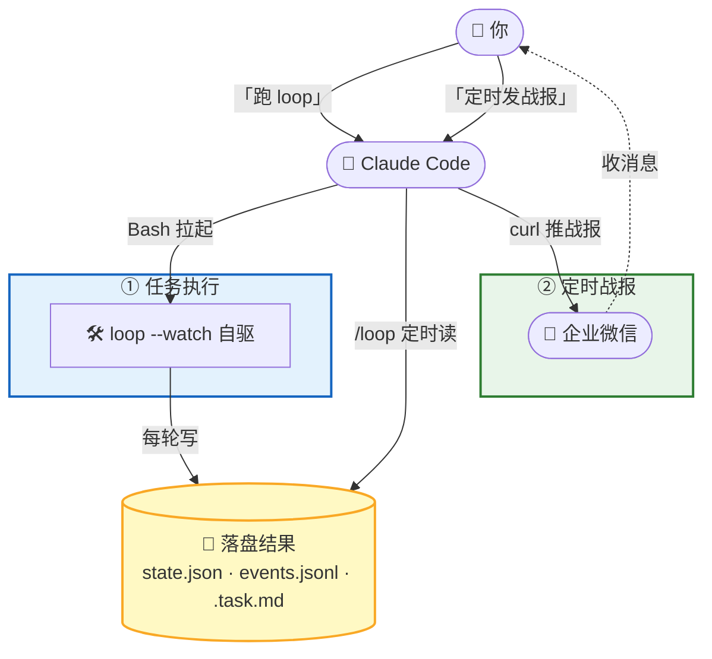

# Claude Code 最佳配置实战：任务执行 + 定时战报



这篇假设你只跟 Claude Code 对话、不碰命令。你说话，Claude Code 干活：装 loop、跑 loop、读结果发企业微信。

两件事对仗：**任务执行**（loop 自驱干开发）/ **定时战报**（Claude Code 定时读结果推企业微信）。Claude Code 只读结果发战报，不拉起、不守护 loop——各管各的。

## 前置：先把环境备好

还没装 loop 的话，把这条发给 Claude Code：

> 帮我把 loop 装好。读 https://raw.githubusercontent.com/free-wyq/loop/main/install.md 按里面的步骤执行，装好后把我的密钥/代理/模型配进 ~/.config/loop.env。需要什么密钥你来问我。

企业微信群机器人：把这条发给 Claude Code「帮我配企业微信群机器人，我要用它收 loop 战报」——它会问你要群机器人的 webhook URL（企业微信群里建个机器人就有）。

下文 `<项目>` 一律是你的项目绝对路径，如 `/home/you/work/myapp`。

## 1. 任务执行：让 Claude Code 跑 loop

把这条发给 Claude Code：

> 在 `<项目>` 跑 loop，目标「把缺陷表里失败的项全修了」，后台跑、日志写到 night_run.log。

Claude Code 用 Bash 工具拉起 `loop --cwd <项目> "目标"`，loop --watch 自驱：自己拆任务 → 逐个推进 → 每轮 commit。崩了能从 state.json 续跑（不丢进度、不重复打勾）。

拉起/守护 loop 是你（或让 Claude Code 帮你配 systemd `Restart=always`）的事，**不是定时战报的职责**——定时战报只读结果、不干预推进。

> ⚠️ 目标项目绝不能是 loop 仓库自身，会污染 git 历史。

## 2. 定时战报：让 Claude Code 定时读结果推企业微信

loop 把结果结构化落盘（`state.json` 恢复点 / `events.jsonl` 审计流 / `.task.md` 进度），Claude Code 用 `/loop` 定时读这些自行组织战报，再用 curl 推企业微信。loop 本身不掺和战报生成。

### 2.1 每 5 分钟状态推送

把这段发给 Claude Code（它会用 `/loop` 建成每 5 分钟的定时任务，到点读结果、组消息、curl 推企业微信）：

```
用 /loop 每 5 分钟跑一遍。每次做这些事：
1. 读 `<项目>` 的 night_run.log 最后 15 行
2. 跑 loop --cwd `<项目>` --status 拿状态
3. 读 `<项目>/.task.md` 拿任务列表
4. 按下面格式组一条中文消息
5. curl POST 到企业微信 webhook 推出去（webhook URL 我之前给过你）

📊 loop 战报 [当前时间]

✅ [已完成的任务，带简述，没有则写「暂无」]

🔄 第 N 轮，剩余 X/Y

📋 进行中：[当前任务简述]

🔧 当前操作：[从日志提取最新动作，如「正在改 xxx」「跑 typecheck」「commit 中」]

⏱ 心跳：[最后心跳时间]（启动 [启动时间]，已运行 [时长]）

📊 进度：[已完成数]/[总数]

🧹 [上下文压缩状态，有 /compact deep 则显示「上下文 XM→YK（/compact deep 压缩成功）」，无则不显示此行]

⚠️ [异常标注：空转/阻塞/报错/崩溃才显示，无异常则不显示此行]

要求：loop 命令已配好 ~/.config/loop.env，直接跑 loop --cwd `<项目>` --status 即可，别 export 环境变量、别 source ~/.bashrc；启动时间从 night_run.log 第一行的 orchestrator 启动时间提取；心跳从 state.json 的 last_heartbeat_at 读；已完成的任务用「已完成」不用「已修复」；curl 推企业微信用 markdown 消息类型，每个字段单独一行、字段间空一行，简洁一目了然。
```

### 2.2 每日晨报

把这段发给 Claude Code（它会用 `/loop` 建成每天定点的定时任务）：

```
用 /loop 每天早上 9 点跑一遍，生成 `<项目>` 的晨报推企业微信：
1. 跑 loop --cwd `<项目>` --status 获取状态
2. 读 .task.md 统计任务完成情况（已完成 [x] / 未完成 [ ] / 阻塞 [~] / 总数）
3. 读 night_run.log 末尾 50 行获取最近执行情况
4. 读 state.json 的 loop_count、status、event_counts 字段
5. 读 events.jsonl 末尾 20 行，提取 task_completed / task_blocked / aborted / done 等关键事件
6. 跑 git log --oneline -20 --since=yesterday 检查代码提交
7. curl POST 到企业微信 webhook 推出去

输出中文 markdown 晨报：任务总进度 / 当前状态 / 进行中任务 / 代码提交情况（commit 数量+内容摘要）/ 异常汇总（如有）/ 结论。
```

### 2.3 战报格式参考

三种场景（推进中 / 有异常 / 全部完成）的参考格式见 [skill/SKILL.md](skill/SKILL.md)。文案/格式/频道全由你定，loop 只保证结果结构化落盘，不掺和战报生成。

> 💡 想把「推企业微信」做成工具化能力？把那段 curl 包成一个 MCP server，Claude Code 就能当工具调用。但这不是必需——Bash 直接 curl 最稳、零额外依赖。

## 常用操作（都对 Claude Code 说）

- 「看下 loop 现在啥状态」
- 「停一下 loop」/「恢复 loop」
- 「出个运行报告」
- 「把战报手动发一次」
- 「停掉定时战报」/「看下还有哪些定时任务在跑」

## 排查（都对 Claude Code 说）

- **战报不发了**：先问「企业微信 webhook 还通吗」——让 Claude Code curl 测一下 webhook，webhook URL 失效或被删消息就静默丢，loop 这边一切正常也收不到。
- **loop 卡住没进展**：让 Claude Code 读 state.json 的 `last_heartbeat_at`，比当前时间老超过 60 分钟且 `status=running` → watch 卡死了（进程没崩但 query 挂死）。`loop --cwd <项目> --stop` 干净停掉再重启。
- **定时战报突然全停、一条都不来**：多半是某次 `/loop` 执行卡死把后续排队了。让 Claude Code 看下定时任务有没有卡住的执行、卡住的清掉、再手动触发一次战报。通常是战报 prompt 里跑了会超时的命令（如等 `loop --status` 阻塞）——改成别在战报里跑长命令，或用超时包裹。

## 解耦关系

- **任务执行（loop --watch）** 自驱推进，崩了 state.json 续跑（不丢进度、不重复打勾）。拉起/守护是用户或 systemd 的事，不是 Claude Code 战报的。
- **定时战报（Claude Code）** 只用 `/loop` 定时读结果组织战报、curl 推企业微信。不拉起、不守护 loop。

loop 崩了 → Claude Code 战报照样发、告诉你它挂了（状态停滞 / 心跳超时）；Claude Code 会话关了 → loop 继续推进；企业微信挂了 → 两者都不受影响。
