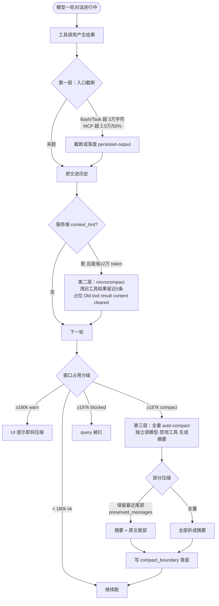

# Claude Code CLI 如何管理上下文

> 写在 200k 窗口的硬上限下，CLI 怎么把"远超窗口的活"做完。
>
> 本文所有数字与字符串均来自已安装的 `@anthropic-ai/claude-agent-sdk-linux-x64/claude` 二进制（`claudeCodeVersion 2.1.218`，构建 `2026-07-22`）的反编译取证，非推测。常量可能随版本变动。

---

## 一、核心结论先行

**Claude Code CLI 从不向 API 发送超过上下文窗口的内容。**

窗口是硬上限——默认 200,000 token（二进制常量 `BCe=200000`），Sonnet 4/4.5 开 `context-1m-2025-08-07` beta 后可到 1,000,000。每个发出去的请求都被压在这个上限之内。

那"做了远超窗口的活"是怎么来的？三层叠加的错觉：

1. **工具结果入口截断**——大输出还没进历史就被砍掉
2. **microcompact**——服务端发 hint，外科式清掉旧工具结果
3. **全量 auto-compact**——到阈值时，单独调一次模型生成摘要，替换老历史

加上**文件系统才是真正的持久层**——代码改在磁盘上，不在上下文里。压缩只丢对话历史，已落盘的产物一根毫毛不动。模型做了 50 万 token 的活，绝大部分以"文件"留在外面，下一轮只读它需要的部分回来。

所以"超窗口工作" = 磁盘累积产物 + 对话滚动压缩 + 工具结果入口截断。每一步模型看到的上下文都没超窗口，但产出的总和可以远超。

---

## 二、第一层：工具结果入口截断

大输出在进入对话历史之前就被砍。每个工具族有自己的字符上限，由 `o$e(name, envValue, default, upper)` 解析：

| 工具 | 环境变量 | 默认 | 上限 |
|---|---|---|---|
| Bash | `BASH_MAX_OUTPUT_LENGTH` | `CXi = 30000` 字符 | `TXi = 150000` |
| Task（子 agent） | `TASK_MAX_OUTPUT_LENGTH` | `qLs = 32000` 字符 | `WLs = 160000` |
| MCP 工具 | `MAX_MCP_OUTPUT_TOKENS` | 服务端 flag 控制 | 硬上限 `xsy = 25000` 字符 |

MCP 的截断逻辑最细：估算 token 超过输出预算的 50% 就触发，截断提示带尾部缓冲 `bUu = 1600`，提示文案是：

> `...output was truncated. If this MCP server provides pagination or filtering tools, use them to retrieve specific portions of the data...`

更大的输出直接落盘：超过 IPC 帧限制或 50MB（`output truncated at 50MB`）时，内容写到文件，历史里只留一个 `<persisted-output>` 占位指针——模型看到的是指针，不是全文。

**这一层的意义**：读一个大文件、跑一个刷屏的命令，不会一下子把几万 token 灌进上下文。入口就拦住了。

---

## 三、第二层：microcompact —— 服务端驱动的外科式裁剪

这是最精巧的一层。它**不生成摘要**，只做占位替换。

### 触发方式

由**服务端 `context_hint`** 驱动（beta 头 `context-hint-2026-04-09`，通过 SSE 下发 `context_hint_sse`）。服务端发现上下文快满了，告诉客户端："去清掉旧工具结果"。

客户端收到后调用 `htd(e, t, {keepRecent: 5, persist: Sk_})`。

### 做什么

- **只针对特定工具族的结果**：Read、Bash、Glob/Grep 一族
- **保留最近 5 条**（`sXd = 5`）原文不动
- **更早的清掉**，内容替换成字面量：

  > `[Old tool result content cleared]`

- **只在能省 ≥ 20000 token 时才动**（`rTs = 20000`），否则 no-op——清了半天省不下多少就不值得

### 边界标记

清完发一条 `microcompact_boundary` 系统消息，UI 标记 `compact_micro_keep_recent`，遥测事件 `tengu_time_based_microcompact`。大输出还能走 `persist` 回调落盘，历史里留指针。

### 为什么这一层重要

它是**外科手术**而非**全身麻醉**。全量压缩要调模型、要时间、要 token；microcompact 只是本地字符串替换，便宜、快、精确——只动确定可以丢的旧工具结果，对话语义一点不变。

---

## 四、第三层：全量 auto-compact —— 调模型生成摘要

当 microcompact 也压不住，到阈值就触发全量压缩。

### 阈值分级

二进制里的阈值函数 `Xuo(e, t)`：

```js
function Xuo(e, t) {
  let r = e - 13000;                 // e = 有效窗口；13000 token 缓冲
  let n = t.testPctOverride;         // 来自 CLAUDE_AUTOCOMPACT_PCT_OVERRIDE
  if (n !== undefined && !isNaN(n) && n > 0 && n <= 100)
    return Math.min(Math.floor(e * (n / 100)), r);
  return r;                          // 默认：window - 13000
}
```

分级常量：`iRu = 20000` / `JIu = 13000` / `QIu = 3000`。以默认 200k 窗口算：

| 级别 | 条件 | 动作 |
|---|---|---|
| `ok` | < 180k（window − 20000） | 无 |
| `warn` | ≥ 180k | UI 提示「Autocompact will trigger soon, which discards older messages. Use /compact now to control what gets kept.」 |
| `compact` | ≥ 187k（window − 13000） | **auto-compact 触发** |
| `blocked` | ≥ 197k（window − 3000） | query 被拦，太接近上限 |

UI 文案实锤：`Autocompact will trigger soon...` / `Compaction is disabled.` / `Autocompact is disabled.` / `/autocompact to configure`。

### 压缩本身是一次独立的模型调用

**不是本地启发式**。CLI 单独发一次 single-turn 请求给模型，期间**禁用所有工具**：

> `Tool use is not allowed during compaction`
> `CRITICAL: Respond with TEXT ONLY. Do NOT call any tools.`

强制模型只输出文本摘要。摘要 prompt 有两个版本：

**全量摘要（`aCy`）**：

> Your task is to create a detailed summary of the conversation so far, paying close attention to the user's explicit requests and your previous actions.

**保留尾部的摘要（`cCy`，suffix-preserving）**：

> Your task is to create a detailed summary of this conversation. This summary will be placed at the start of a continuing session; newer messages that build on this context will follow after your summary (you do not see them here). Summarize thoroughly so that someone reading only your summary and then the newer messages can fully understand what happened and continue the work.

第二个 prompt 的措辞很关键——它告诉模型"你摘要之后还会有新消息跟在后面"，所以摘要要为后续上下文服务。

---

## 五、部分压缩：保留最近的尾巴

全量压缩不必把整段历史全压成摘要。`compact_boundary` 系统消息的 `compact_metadata` 里有保留信息：

```ts
compact_metadata: {
  trigger: 'manual' | 'auto',
  pre_tokens: number,       // 压缩前
  post_tokens?: number,     // 压缩后
  preserved_segment?: { head_uuid, anchor_uuid, tail_uuid },
  preserved_messages?: { anchor_uuid, uuids: UUID[] }
}
```

两种保留模式：

- **suffix-preserving**（常见）：老的压成摘要，**最近的若干条原文保留**，摘要 splice 在 `anchor_uuid` 处
- **prefix-preserving partial**：保留老的，压中间/最近的（少见）

被压掉的老消息**仍在磁盘 transcript 里**（所以 `/rewind` 能回到压缩前），只是不再发给 API。压缩后的摘要消息打 `isCompactSummary: true` 标记，后续提取逻辑会跳过它。

### 系统提示、文件编辑、todo 怎么办

- **系统提示**：每轮重新构建（从 CLAUDE.md / skills / agents 拼装），不进被压缩的消息历史，压缩碰都不碰
- **文件编辑**：本质是 `tool_use` + `tool_result` 消息对，跟别的消息一样被摘要或保留；磁盘上的实际改动当然不回滚
- **todo**：`TodoWrite` 也是对话消息，在保留尾部的就原文留着，老的折进摘要

---

## 六、服务端压缩新路径：`compact_20260112`

旧客户端路径 `compactionControl` 已**标记 deprecated**，二进制警告：

> `The compactionControl parameter is deprecated and will be removed in a future version. Use server-side compaction instead by passing edits: [{ type: "compact_20260112" }] in the params passed to toolRunner().`

对应 beta 头 `compact-2026-01-12`。意思是压缩逻辑从"客户端发额外请求算摘要"迁到"服务端在主请求里直接处理"。这是趋势，但旧路径目前还能用。

---

## 七、文件系统才是真正的持久层

这三层压缩解决的都是"对话历史"的膨胀。但 CLI 干的活——改的代码、建的文件、跑的命令产生的副作用——**都在磁盘上，不在上下文里**。

压缩丢的是对话，不是产物。所以：

- 模型这轮读了 10 个文件、改了 3 个，上下文里是这些读写消息
- 下一轮压缩后，对话摘要里只剩"改了 A/B/C 三个文件，加了 X 功能"
- 真正的代码在磁盘上，模型需要时再读回来

这才是"远超窗口工作"的真正承载者。上下文窗口管的是"模型这一步能看到多少"，磁盘管的是"工程累积了多少"。CLI 把这两者彻底分开。

---

## 八、配置旋钮总表

### 环境变量

| 环境变量 | 作用 |
|---|---|
| `DISABLE_COMPACT` | 全关（auto + manual） |
| `DISABLE_AUTO_COMPACT` | 只关 auto，手动 `/compact` 仍可用 |
| `CLAUDE_CODE_AUTO_COMPACT_WINDOW` | 覆盖窗口大小（1e5–1e6） |
| `CLAUDE_AUTOCOMPACT_PCT_OVERRIDE` | 覆盖触发百分比（1–100） |
| `CLAUDE_CODE_BLOCKING_LIMIT_OVERRIDE` | 覆盖 blocking 限 |
| `BASH_MAX_OUTPUT_LENGTH` | Bash 输出上限（默认 30000，上限 150000） |
| `TASK_MAX_OUTPUT_LENGTH` | 子 agent 输出（默认 32000，上限 160000） |
| `MAX_MCP_OUTPUT_TOKENS` | MCP 工具结果 |
| `MCP_TRUNCATION_PROMPT_OVERRIDE` | 覆盖 MCP 截断提示文案 |

### Settings 层

| 旋钮 | 含义 |
|---|---|
| `autoCompactEnabled` | 上下文快满时自动压缩（默认开） |
| `autoCompactWindow` | 自动压缩窗口（1e5–1e6） |
| `precomputeCompactionEnabled` | @internal 后台预计算压缩摘要，到阈值时直接用 |
| `verbose` | 显示完整工具输出而非截断摘要（仅显示，不影响发往 API 的截断） |

### Hooks

压缩前后会触发：`PreCompact` / `PostCompact`。`PostCompact` 钩子能拿到 `compact_summary: string`（生成的摘要全文）。

---

## 九、三层联动的完整流程



---

## 十、边界与局限

写清楚不兜的地方，不拔高：

1. **单次 query 内模型陷入无限推理循环**——CLI 没有"单 query 超时"。三层压缩都管不到"模型在一个请求里无限输出"。这要靠外部看门狗（如 swallow 的 `ABORT_TIMEOUT_MIN=60` 靠 PostToolUse 无回调判定）兜，是 CLI 设计上的留白。

2. **摘要会丢细节**——全量压缩靠模型摘要，模型可能漏掉它认为不重要但实际关键的细节。保留尾部（suffix-preserving）缓解，但不消除。

3. **microcompact 只管工具结果**——纯对话内容（用户长篇大论、模型长篇思考）不在 microcompact 范围内，只能等全量压缩。

4. **常量会变**——本文的 13000/3000/20000、keepRecent=5、Bash 30000 都是 v2.1.218 的值，Anthropic 后续版本可能调整。

5. **服务端压缩是趋势**——`compact_20260112` 路径会逐步取代客户端 `compactionControl`，具体行为以官方文档为准（本文写于无法访问 `platform.claude.com` 的环境，全部基于二进制反编译）。

---

## 附：取证出处

所有事实来自 `node_modules/@anthropic-ai/claude-agent-sdk-linux-x64/claude`（ELF 二进制，`claudeCodeVersion 2.1.218`，构建 `2026-07-22T17:40:42Z`，`GIT_SHA bce61b433`）的 `strings`/`grep -a` 取证：

- 窗口常量 `BCe=200000`、分级 `iRu=20000`/`JIu=13000`/`QIu=3000`
- 阈值函数 `function Xuo(e,t){let r=e-13000;...}`
- microcompact：`sXd=5`、`rTs=20000`、`Old tool result content cleared`、`microcompact_boundary`、`tengu_time_based_microcompact`、`context-hint-2026-04-09`
- 截断：`CXi=30000`/`TXi=150000`/`qLs=32000`/`WLs=160000`/`xsy=25000`/`bUu=1600`、`output truncated at 50MB`、`persisted-output`
- 摘要 prompt `aCy`/`cCy`、`Tool use is not allowed during compaction`、`CRITICAL: Respond with TEXT ONLY`
- 服务端路径 `compact_20260112` / `compact-2026-01-12`、`compactionControl` deprecated 警告
- env 变量：`DISABLE_COMPACT`/`DISABLE_AUTO_COMPACT`/`CLAUDE_CODE_AUTO_COMPACT_WINDOW`/`CLAUDE_AUTOCOMPACT_PCT_OVERRIDE`/`CLAUDE_CODE_BLOCKING_LIMIT_OVERRIDE`/`BASH_MAX_OUTPUT_LENGTH`/`MAX_MCP_OUTPUT_TOKENS`
- UI 文案：`Autocompact will trigger soon...`、`/autocompact to configure`

---

*版本：2026-07-26 · 基于 claude v2.1.218 二进制取证*
