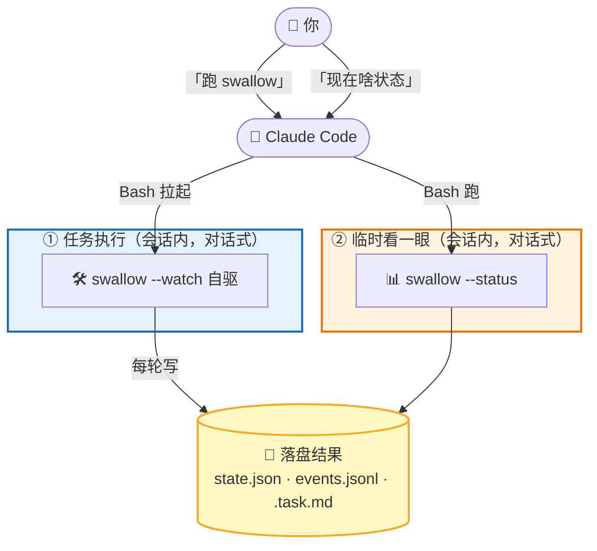

# Claude Code 最佳配置实战：任务执行 + 状态查看

这篇假设你只跟 Claude Code 对话、不碰命令。你说话，Claude Code 干活：装 swallow、跑 swallow、随时给你看状态。

Claude Code 在 swallow 体系里只干两件事：**任务执行**（拉起 swallow 自驱推进）/ **临时看一眼**（跑 `--status` 给你看当前进度）。它**不守护 swallow、不发定时战报**——这两件是 OS 层 / 常驻 agent 的活，不归 Claude Code（见末尾「边界」）。

## 前置：先把环境备好

还没装 swallow 的话，把这条发给 Claude Code：

> 帮我把 swallow 装好。读 https://raw.githubusercontent.com/free-wyq/swallow/main/install.md 按里面的步骤执行，装好后把我的密钥/代理/模型配进 ~/.config/swallow.env。需要什么密钥你来问我。

下文 `<项目>` 一律是你的项目绝对路径，如 `/home/you/work/myapp`。

## 1. 任务执行：让 Claude Code 跑 swallow

把这条发给 Claude Code：

> 在 `<项目>` 跑 swallow，目标「把缺陷表里失败的项全修了」，后台跑、日志写到 night_run.log。

Claude Code 用 Bash 工具拉起 `swallow --cwd <项目> "目标"`。swallow `--watch` 自驱：自己拆任务 → 逐个推进 → 每轮 commit。崩了能从 state.json 续跑（不丢进度、不重复打勾）。

拉起后 swallow 是**独立后台进程**，跟 Claude Code 会话生死无关——你关终端、关 Claude Code，swallow 照样推进；想让它崩了也能自动拉起，让 Claude Code 帮你配 systemd `Restart=always`。守护是 OS 层的事，不是 Claude Code 的职责。

> ⚠️ 目标项目绝不能是 swallow 仓库自身，会污染 git 历史。

## 2. 临时看一眼：让 Claude Code 给你看当前状态

你碰巧在终端、想知道 swallow 跑到哪了，把这句发给 Claude Code：

> 看下 swallow 现在啥状态。

Claude Code 用 Bash 跑 `swallow --cwd <项目> --status`，把多行实时状态读出来给你：第几轮、idle/running/blocked、心跳时间、已完成/未完成/阻塞各几个、最近事件。需要更细的运行报告就说「出个运行报告」（`--report`）。

**这是即时检查，不是定时**——你问一次它看一次，不会自动反复看。要定时反复看（定时战报），见末尾「边界」。

## 常用操作（都对 Claude Code 说）

- 「停一下 swallow」/「恢复 swallow」（`--stop` 写哨兵 / `--resume` 删哨兵）
- 「出个运行报告」
- 「看下 `.task.md` 任务列表」

## 排查（都对 Claude Code 说）

- **swallow 卡住没进展**：让 Claude Code 读 `state.json` 的 `last_heartbeat_at`，比当前时间老超过 60 分钟且 `status=running` → watch 卡死了（进程没崩但 query 挂死）。`swallow --cwd <项目> --stop` 干净停掉再重启（`--stop` 发 SIGTERM 会联动终止 claude 子进程，约 10s 干净退出无孤儿；别 `kill -9` 父进程，会让 claude 子进程变孤儿继续烧 token）。
- **状态看着不对、想看原始事件流**：让 Claude Code `tail` 一下 `events.jsonl` 末尾几行，看 `tick_started` 有没有配对的 `tick_completed`（无配对 = 该 tick 崩了）。

## 边界：Claude Code 不干什么

Claude Code 是**会话内交互工具**，不是常驻调度器。swallow 体系里三件事的归属：

| 事 | 归谁 | 为什么不归 Claude Code |
|---|---|---|
| 任务推进 | swallow `--watch` 自驱 | 进程内 tick 循环，不靠外部触发 |
| **定时战报** | **OS crontab + bash 脚本**，或 **Hermes** | Claude Code 没有常驻进程，`/loop` 之类会话内定时在终端一关就死，到不了 24h |
| 守护/自动拉起 | systemd `Restart=always` | 同上，OS 层的事 |

**定时战报的正道是 OS 层，不经 Claude Code**：一个轻量 bash 脚本（`swallow --status --json` 拿结构化数据 + `curl` 推企业微信 webhook）挂 `crontab`，每 5 分钟跑一次、几秒就退出——最轻最稳，不烧 token。`--status --json` 是 swallow 原生吐的 JSON，用任何能读 JSON 的工具（python/node/awk）解析即可，**不依赖 jq 这类非标配工具**。要战报能力见 [hermes-guide.md](hermes-guide.md)（Hermes 有原生常驻 cron），或自己写 bash + crontab。

## 解耦关系

- **任务执行**（swallow `--watch`）自驱推进，崩了 state.json 续跑。拉起是 Claude Code 帮你一次、之后 swallow 自管。
- **状态查看**（Claude Code）只在你问时跑一次 `--status`，不守护 swallow、不发定时战报。

swallow 崩了 → Claude Code 会话照样能开、跑 `--status` 告诉你它挂了（状态停滞 / 心跳超时）；Claude Code 会话关了 → swallow 继续推进；战报通道挂了 → 两者都不受影响。
