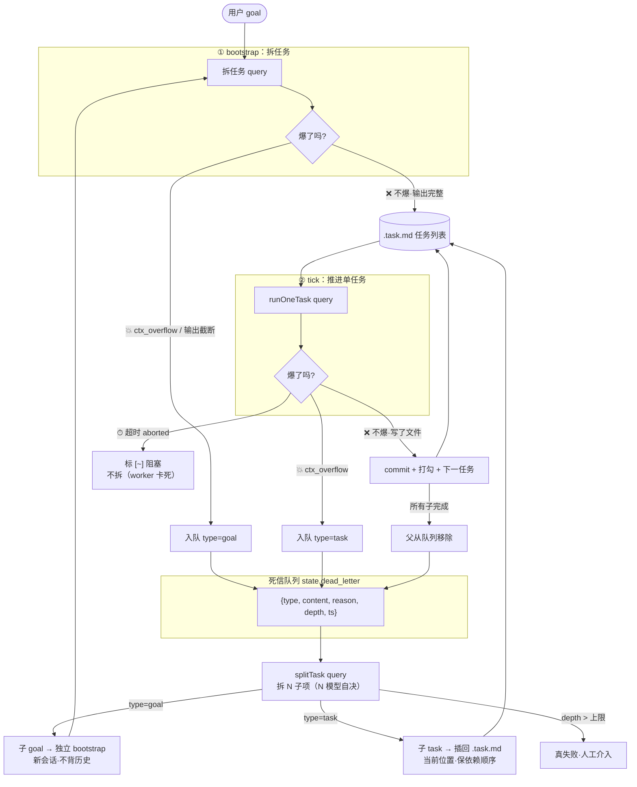

# 死信队列 + lazy 拆：史诗级任务设计

> 状态：**设计草案，未实现**。抓包 13 轮 0 爆，按"别为没发生的崩提前上"暂不动代码。本文是等真撞墙时照着实现的蓝图。
>
> 相关：token 量纲与探针背景见 memory `orchestrator-sdk.md`「ctx 健康度探针」「token 量纲澄清」段；预先递归为何不上见 memory `arch-pending-usage-gated.md`。

## 1. 要解决的问题

现有机制只**防崩**不**完成任务**：

- **bootstrap 爆**：goal 太大一次拆不完，query 撑爆或输出截断（50 个任务只写出来 5 个），现状 `orchestrator.ts:1040-1045` 只在 `taskLines.length===0` 报错，截断静默丢——45 个任务没了还误判 done。
- **tick 爆**：单任务太大一个会话装不下，runOneTask 报 ctx_overflow，现状走 `session_retries++` → 重试 3 次 → `blockFirst()` 标 `[~]` 跳过。**任务永远没做**，烫手山芋被扔了。

两者共同点：**任务/goal 太大**。共同解法：**爆了就拆小，直到不爆**。

## 2. 核心判据

> **不爆说明够用、爆就继续拆。**

深度不靠智能体猜（预先递归 Layer 3 的最大冲突——没全局视野猜不准），用"爆没爆"这个**确定事实**判定。任务/goal 自然收敛到刚好不爆的粒度：拆浅了还爆就再拆，拆到不爆就停。

这是反馈驱动，不是预先猜测。

## 3. 架构图

### Mermaid



## 4. 数据结构

### 4.1 死信队列元素

存 `state.dead_letter` 数组（跟 `event_counts` 同模式：原子写一起、`--status` 能看、崩溃恢复靠现有 state.json 原子写）。不另开文件——多一个文件多一个崩坏面。

```typescript
interface DeadLetterItem {
  type: "goal" | "task";       // 爆点类型：goal=bootstrap 拆任务爆，task=tick 干活爆
  content: string;            // 爆掉的原内容（goal 文本 / task 行文本）
  reason: "ctx_overflow" | "truncate" | "bootstrap_overflow";
                               // ctx_overflow=query 报 context；
                               // truncate=bootstrap 输出截断（sentinel 未见）；
                               // bootstrap_overflow=bootstrap query 本身爆
  split_depth: number;         // 已拆次数（防无限拆，超 SPLIT_DEPTH_LIMIT 真失败）
  ts: string;                  // 入队时间（本地时间，同 now()）
  parent_id?: string;          // 父项 id（子完成联动父移除用，见 §7）
  child_ids?: string[];       // 拆出的子项 id（父等子全完成用）
}
```

### 4.2 state.json 扩展

在 `StateJson` interface 加一字段（`orchestrator.ts:404` 附近）：

```typescript
dead_letter: DeadLetterItem[];   // 死信队列（爆掉的任务/goal 待拆）
```

`DEFAULT_STATE` 加 `dead_letter: []`。`readStateJson` 的 `{ ...DEFAULT_STATE, ...obj }` 自动向前兼容（旧 state 无此字段补空数组）。

## 5. 四个 query 调用点

swallow 现有三个 query 调用点，本设计加第四个 `splitTask`：

| 调用点 | 作用 | resume | hooks | 现状 |
|---|---|---|---|---|
| `bootstrapTasks` | 拆任务 | 否（无 session） | 无 | 已有 |
| `runOneTask` | 干活 | 是（resume 同会话） | 全 hook | 已有 |
| `probeCompactDeep` | ctx 探针 | 是（监听 compact_boundary） | 无 | 已有 |
| **`splitTask`**（新增） | 把爆掉的项拆成 N 个子项（N 不固定，模型自决） | 否（新会话） | 无 | **本设计加** |

`splitTask` 输入 `DeadLetterItem`，输出子项列表：

```typescript
async function splitTask(item: DeadLetterItem): Promise<string[]> {
  // prompt：把这个 {goal/task} 拆成若干个独立、可单独完成的子项。
  // ⚠️ 子项数量不固定、完全由模型自决——大任务可能拆 5+ 个、小任务可能只拆 2 个。
  //    不限制数量：拆少了还爆就再拆（反馈驱动），拆多了能装下就行。
  //    唯一约束是「每个子项要能在单个会话内独立完成」（同 bootstrap 小任务约束），数量交给模型判断。
  // 输出格式同 bootstrap：- [ ] 子项描述
  // 拿到子项后，caller 按 item.type 决定插到哪：
  //   goal → 独立 bootstrap 流（子 goal 入队等下次 watch 跑 / 直接拆到 .task.md？见 §6 决策点）
  //   task → 插回 .task.md 当前位置
}
```

## 6. 处理流程（按爆点类型分流）

### 6.1 tick 爆（type=task）—— 改 `orchestrator.ts:811-830`

**现状**：
```typescript
if (aborted || isCtxOverflow) {        // 两种都 session_retries++
  state.session_retries++;
  ...
  if (state.session_retries >= SESSION_RETRY_LIMIT) {
    blockFirst();                      // 标 [~] 跳过，任务永远没做
  }
}
```

**改后**：先分流（aborted 不拆 / ctx_overflow 才拆），再在达限时把 `blockFirst()` 换成入死信队列 + 拆：

```typescript
if (aborted || isCtxOverflow) {
  state.session_retries++;
  const reason = aborted ? "aborted" : "ctx_overflow";
  clearSessionId();
  appendEvent("session_dropped", { reason, ... });
  if (state.session_retries >= SESSION_RETRY_LIMIT) {
    if (aborted) {
      // 看门狗超时：worker 卡死，任务可能不大 → 拆了拆出的子任务照样卡，继续走老 block
      blockFirst();
      appendEvent("task_blocked", { reason: "aborted_timeout" });
    } else {
      // ctx_overflow：任务太大一个会话装不下 → 入死信队列等拆
      const item: DeadLetterItem = { type: "task", content: taskLine, reason: "ctx_overflow", split_depth: 0, ts: now() };
      enqueueDeadLetter(item);
      appendEvent("task_to_dlq", { task: taskKey, reason: "ctx_overflow" });
      removeFirst();   // 从 .task.md 移除原任务行（避免重复推进），子项由 splitTask 插回
    }
    state.session_retries = 0;
    state.stall_task = null;
    state.stall_count = 0;
  }
  ...
}
```

### 6.2 bootstrap 爆（type=goal）—— 改 `bootstrapTasks` + 加截断检测

**现状缺口**：`orchestrator.ts:1040-1045` 只 `length===0` 报错，截断静默丢。**这是上本设计的必要前提，不是可选。**

**改后**：加 sentinel 检测 + ctx_overflow 检测，爆了不入 `process.exit(1)`，改入死信队列：

```typescript
async function bootstrapTasks(goal: string) {
  const q = query({ prompt: `... 同现状 + 末尾输出 <!-- END_OF_TASKS -->`, options: {...} });
  let text = "";
  let bootstrapOverflow = false;
  for await (const msg of q) {
    if (msg.type === "result") {
      const r = msg as SDKResultMessage;
      if (r.subtype === "error_during_execution" && /context/i.test(...)) bootstrapOverflow = true;
      text = r.subtype === "success" ? (r.result ?? "") : (r.errors ?? []).join("\n");
    } ... // 收 assistant 文本
  }
  const truncated = !text.includes("<!-- END_OF_TASKS -->");
  const taskLines = text.split("\n").filter((l) => /^- \[ \]/.test(l));

  if (bootstrapOverflow || truncated) {
    // goal 太大一次拆不完 → 入死信队列 type=goal，让 splitTask 拆成子 goal
    log(`💥 bootstrap ${bootstrapOverflow ? "ctx_overflow" : "输出截断（${taskLines.length} 个任务可能不完整）"}，goal 入死信队列待拆`);
    enqueueDeadLetter({ type: "goal", content: goal, reason: bootstrapOverflow ? "bootstrap_overflow" : "truncate", split_depth: 0, ts: now() });
    appendEvent("bootstrap_to_dlq", { goal, reason: bootstrapOverflow ? "ctx_overflow" : "truncate", partial_count: taskLines.length });
    // 不 process.exit(1)，让 watch 继续跑处理死信队列
    return;
  }
  writeFileSync(TASK_FILE, taskLines.join("\n") + "\n");
  ...
}
```

### 6.3 splitTask 出队 —— watch 循环或 tick 入口检查死信队列

watch 每轮 tick 入口优先看死信队列有没有待拆项（或在 watch while 里专门的 phase）：

```typescript
// tick 入口：死信队列优先处理
if (state.dead_letter.length > 0) {
  const item = state.dead_letter[0];
  if (item.split_depth >= SPLIT_DEPTH_LIMIT) {
    // 拆到底还爆 → 真失败人工介入
    appendEvent("task_failed", { content: item.content, reason: "split_depth_exceeded" });
    log(`🚫 任务拆到第 ${item.split_depth} 层仍爆，登记真失败待人工：${item.content}`);
    state.dead_letter.shift();   // 移出队列（不再重试）
    writeStateJsonAtomic(state);
    continue;
  }
  const children = await splitTask(item);   // 拆 N 子项（N 模型自决，大任务可能 5+、小任务可能 2）
  if (children.length === 0) {
    // 拆分 query 自己也爆 / 拆不出 → 进死信队列不无限重试拆
    log(`⚠️ splitTask 拆失败（可能自爆），${item.content} 进真失败`);
    state.dead_letter.shift();
    continue;
  }
  // 按 type 分流
  if (item.type === "goal") {
    // 子 goal：插回死信队列头部等独立 bootstrap（或直接调 bootstrapTasks 跑）
    for (const c of children) {
      state.dead_letter.unshift({ type: "goal", content: c, reason: "split", split_depth: item.split_depth + 1, ts: now(), parent_id: item.id });
    }
  } else {
    // 子 task：插回 .task.md 当前位置（保依赖顺序）
    insertTasksAtCurrentPosition(children);
  }
  // 父项标记为等子完成（不从队列删，等子全完成才移除，见 §7）
  item.child_ids = children.map(...);
  state.dead_letter.shift();   // 父已拆出子项，移出；子完成联动由 child 的 parent_id 追踪
  writeStateJsonAtomic(state);
  continue;   // 下一 tick 继续推进（子项已在 .task.md 或子 goal 在队列）
}
```

## 7. 父子语义闭环（防队列膨胀 + 任务漏做）

**问题**：父任务入队后拆出子项，子项全完成了，父怎么算 done？否则父永远占队列、或重复推进。

**方案**：用 `parent_id` / `child_ids` 双向追踪。

- 子 task 完成（commit 打勾）时，检查它有没有 `parent_id`。
- 有 → 找父，父的 `child_ids` 里这子标完成。
- 父的 `child_ids` 全完成 → 父从死信队列移除（父 task 隐式 done，不打勾——它的语义是"被拆成子任务完成"，原行已 removeFirst 移走）。
- goal 同理：子 goal 全 done → 父 goal 移除。

**简化**：MVP 可不做父子联动，直接"父拆出子就移出队列、子独立推进"——代价是失去"父任务整体失败检测"，但简单。先 MVP 后加。

## 8. 兜底（三个防死循环 + 两个真失败收场）

### 8.1 防死循环（三个）

| 风险 | 兜底 |
|---|---|
| splitTask query 自己也爆 | 拆失败（`children.length===0`）直接进真失败册，不无限重试拆 |
| 无限拆分（子任务 A↔B 互相依赖，永远拆不出独立可完成的） | `SPLIT_DEPTH_LIMIT`（建议 3）硬上限，超了进真失败册 |
| "一次不爆≠稳定"（这轮 compact 压下去没爆，下轮又涨上来爆） | 固有简化，暂接受。didRealWork 看写文件判"过"的局限要知道——拆分依赖它，但这是现有机制，不在本设计范围改 |

### 8.2 真失败收场（两个，补"拆到底还失败，任务去哪"的缺口）

现有兜底只到"从死信队列移出 + 发 `task_failed` 事件"——但事件会随 events.jsonl 5000 行轮转丢明细，任务承认做不了却没地方登记，人工看不到。补两环：

**① 真失败登记册（持久化，不止事件）**

加 `state.failed_tasks: DeadLetterItem[]`——跟死信队列同结构同模式，但**终态**（只进不出，不轮转不丢失）：

```
死信队列 state.dead_letter   ← 暂态（待拆/拆中），会出队
真失败册 state.failed_tasks  ← 终态（拆到底做不了），只进不出
```

- 拆到深度上限 / splitTask 自爆 → 从死信队列移出 → **进 `failed_tasks`**（不是只发事件）
- `--status` 显示「❌ 真失败 N 个：任务1、任务2...」
- 人工看 `--status` 就知道 swallow 尽力了哪些做不了

为什么用新数组而非 .task.md 加第四种勾 `[!]`：`.task.md` 的 `[~]` 是"暂时跳过可恢复"，真失败是"永久做不了"，语义不同不该混；且 failed_tasks 是终态汇总，本就该和进度（.task.md）分开。

**② 整体终态（失败累计停 watch）**

单个任务真失败不该直接停整个 goal（其他任务可能不依赖它）。但累计真失败超阈值 → 这个 goal 对当前模型太大/太碎，继续跑也是浪费：

- `failed_tasks.length >= FAILED_TASK_LIMIT`（绝对数，建议 5）→ watch 退出，标 `last_termination={reason:"dead_letter_exhausted"}`，人工介入
- 否则继续推进其他任务，最后 done 时汇总

为什么用绝对数而非比例：简单。失败本该低频，5 个够触发人工介入；任务总数少时绝对数略激进，但总比"比例阈值算总数 + 越界"复杂度低。MVP 先绝对数，真不合适再调。

### 8.3 拆到底失败的完整链条（补齐后）

```
task A 爆 → 死信队列 depth=0
  splitTask → A1 A2 A3 (depth=1) 插回 .task.md
    A1 爆 → 死信队列 depth=1
      splitTask → A1a A1b (depth=2)
        A1a 爆 → 死信队列 depth=2
          splitTask → ... (depth=3)
            子项又爆 → 死信队列 depth=3
              tick 入口: depth >= 3
                → 从死信队列移出
                → 进 failed_tasks（真失败册）        ← 新增 ①
                → task_failed 事件
              failed_tasks 累计 >= 5
                → watch 退出, last_termination={reason:"dead_letter_exhausted"}  ← 新增 ②
                → 人工介入
```

## 9. 新增事件类型（events.jsonl）

| 事件 | 触发 | data |
|---|---|---|
| `task_to_dlq` | tick 爆达限入死信队列 | `{task, reason: "ctx_overflow"}` |
| `bootstrap_to_dlq` | bootstrap 爆/截断入死信队列 | `{goal, reason, partial_count}` |
| `task_split` | splitTask 拆出子项 | `{parent_content, child_count, depth, type}` |
| `task_failed` | 拆到深度上限仍爆 / splitTask 自爆 | `{content, reason: "split_depth_exceeded"\|"split_failed"}` |
| `dead_letter_exhausted` | 真失败累计达 `FAILED_TASK_LIMIT`，watch 退出 | `{failed_count, limit}` |
| `parent_resolved` | 父项子全完成移除（MVP 后） | `{parent_content, child_count}` |

`--status` 加显示死信队列长度 + 真失败册（`failed_tasks` 内容摘要，不只计数——人工要看到哪些任务做不了）。

## 10. 不做（边界）

- **不预先递归**：不在 bootstrap 时猜哪些任务大、提前拆树。只爆了才拆——这是本设计与 Layer 3 预先递归的根本区别（消掉"深度判断"冲突）。
- **不改 .task.md 格式**：不引入树形结构（`.tasktree.json` 之类）。子 task 就是普通 `- [ ]` 行插回 flat 列表，state.json 不感知层级——靠 `parent_id` 软追踪。真失败也不用 `.task.md` 第四种勾 `[!]`——进 `state.failed_tasks`，语义与进度分离。
- **不动 runOneTask 内核**：query + PostToolUse hook + 看门狗不变，只在它出口加"爆了入队"分支。
- **不解决 aborted**：看门狗超时（worker 卡死）继续走老 block，不拆。
- **不做跨子任务协调**：子 task 插回当前位置靠顺序缓解兄弟协调，不做依赖声明语言。

## 11. 与现有机制的层次关系

本设计是**最底层兜底**，不替代上层：

```
Layer 0  ctx 探针 + compact + 弃会话重开      ← 累积爆先压（已自洽，抓包 0 失败）
Layer 1  用户手拆里程碑（纯用法）              ← 80% 情况这层够，不进代码
Layer 2  bootstrap 正则锁骨架（已到位）        ← 输出已是骨架，只缺截断检测（本设计前置）
Layer 3  死信队列 + lazy 拆（本设计）          ← 探针/重试都兜不住才上，反馈驱动拆
```

Layer 3 只在 Layer 0/1/2 都压不住、真撞 ctx_overflow 截断时触发。

## 12. 实现顺序（真上时）

1. 加 `DeadLetterItem` interface + `state.dead_letter` + `state.failed_tasks` 字段 + `DEFAULT_STATE` + `readStateJson` 兼容（自动向前，旧 state 缺字段补默认）。
2. 加 `enqueueDeadLetter` / `shiftDeadLetter` / `moveToFailed`（死信队列 ↔ 真失败册）helper + `removeFirst` / `insertTasksBeforeFirst`（.task.md helper，照 `tickFirst` 骨架 splice）。
3. bootstrap 截断检测（sentinel `<!-- END_OF_TASKS -->`）+ ctx_overflow 检测 → 爆了入死信队列（`bootstrapTasks` 改，不 `process.exit(1)`）。
4. tick L811 分流 aborted/ctx_overflow → ctx_overflow 达限入死信队列（`tick` 改，替代原 `blockFirst()`）。
5. 加 `splitTask` query 调用点（照 `bootstrapTasks` 模式，新会话不 resume，输出解析照抄 `text.split("\n").filter((l) => /^- \[ \]/.test(l))`）。
6. tick 入口加死信队列出队处理（splitTask + 按 type 分流）：`split_depth >= SPLIT_DEPTH_LIMIT` 或 splitTask 自爆 → `moveToFailed`（进真失败册）+ `task_failed` 事件。
7. 真失败累计 `failed_tasks.length >= FAILED_TASK_LIMIT` → watch 退出 + `last_termination={reason:"dead_letter_exhausted"}` + `dead_letter_exhausted` 事件。
8. 加事件类型 + `--status` 显示死信队列长度 + 真失败册内容摘要。
9. 父子语义闭环（MVP 后做）。
10. e2e：构造爆掉的场景（故意喂超大 goal / 超大 task）验证拆分链路 + 真失败收场。

## 13. 重启条件（暂不上）

抓包 13 轮真跑：**0 次 ctx_overflow、0 次 session_dropped、0 次 bootstrap 截断**——入口探针稳态兜住，本设计暂不实现。

**真撞墙时上**：
- events.jsonl 出现 `session_dropped` 且同 taskKey 反复爆到 `session_retries=3` 标阻塞；
- 或 bootstrap 输出明显截断（任务数远少于预期、最后一条像写一半）。

那时按 §12 顺序实现。本文档作为蓝图备查。
