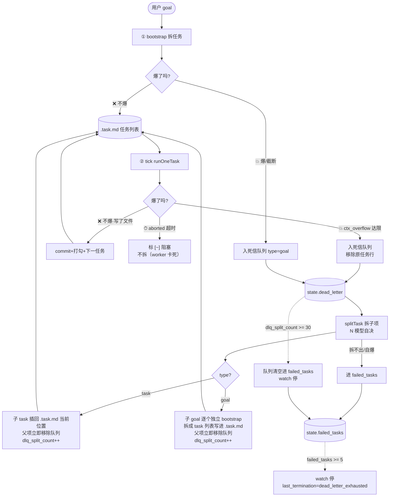

# 死信队列 + lazy 拆：史诗级任务设计

> 状态：**已实现 + e2e 全绿**（2026-07-25，`orchestrator.ts` +288 行，`tsc --noEmit` 通过）。可观测契约见 [dead-letter-observability.md](./dead-letter-observability.md)。
>
> 历史背景：抓包 13 轮 0 爆时本设计是"等真撞墙照着实现的蓝图"；现按用户决定提前全量落地（goal/task 对称统一），e2e 三组验证通过——兜底停 watch（确定性）/ smoke 回归（真跑 bootstrap→done）/ 死信出队链路（真跑 splitTask 拆 5 项→插入→commit）。
>
> 相关：token 量纲与探针背景见 memory `orchestrator-sdk.md`「ctx 健康度探针」「token 量纲澄清」段；预先递归为何不上见 memory `arch-pending-usage-gated.md`。

## 1. 要解决的问题

现有机制只**防崩**不**完成任务**：

- **bootstrap 爆**：goal 太大一次拆不完，query 撑爆或输出截断（50 个任务只写出来 5 个），现状 `orchestrator.ts:1040-1045` 只在 `taskLines.length===0` 报错，截断静默丢。
- **tick 爆**：单任务太大一个会话装不下，runOneTask 报 ctx_overflow，现状走 `session_retries++` → 重试 3 次 → `blockFirst()` 标 `[~]` 跳过。**任务永远没做**，烫手山芋被扔了。

共同点：**任务太大**。共同解法：**爆了就拆小，直到不爆**。

## 2. 核心判据

> **不爆说明够用、爆就继续拆。**

深度不靠智能体猜（预先递归 Layer 3 的最大冲突——没全局视野猜不准），用"爆没爆"这个**确定事实**判定。任务自然收敛到刚好不爆的粒度：拆浅了还爆就再拆，拆到不爆就停。

这是反馈驱动，不是预先猜测。

## 3. 架构图



## 4. 数据结构

### 4.1 死信队列元素（3 字段）

存 `state.dead_letter` 数组（跟 `event_counts` 同模式：原子写一起、`--status` 能看、崩溃恢复靠现有 state.json 原子写）。不另开文件——多一个文件多一个崩坏面。

```typescript
interface DeadLetterItem {
  type: "goal" | "task";   // 爆点类型：goal=bootstrap 拆任务爆，task=tick 干活爆。出队后处理路径不同（见 §6.3）
  content: string;         // 爆掉的原内容（goal 文本 / task 行文本）
  ts: string;              // 入队时间（本地时间，同 now()）
}
```

**为什么 3 字段够、不要更多**：
- `type` 必须：goal 和 task 出队后处理路径不同（goal 子项独立 bootstrap、task 子项插回 .task.md），要区分。两者本质同构（都是"一次装不下"），但处理分流点不同。
- `reason` 不要：爆因（ctx_overflow / 截断 / 自爆）记在 events.jsonl 事件里，队列只管"待拆的内容"，职责分离。
- `split_depth` / `parent_id` / `child_ids`：父子追踪整摊砍掉（见 §7）——死循环兜底用全局计数替代，不依赖 depth 继承。

### 4.2 state.json 扩展（3 个新字段）

在 `StateJson` interface 加（`orchestrator.ts:404` 附近）：

```typescript
dead_letter: DeadLetterItem[];    // 死信队列（爆掉的 task 待拆，暂态）
failed_tasks: DeadLetterItem[];   // 真失败册（拆到底做不了，终态只进不出）
dlq_split_count: number;          // splitTask 累计调用次数（防无限拆死循环）
```

`DEFAULT_STATE` 加 `dead_letter: []` / `failed_tasks: []` / `dlq_split_count: 0`。`readStateJson` 的 `{ ...DEFAULT_STATE, ...obj }` 自动向前兼容（旧 state 缺字段补默认，零迁移）。

### 4.3 顶部常量

```typescript
const FAILED_TASK_LIMIT = 5;      // 真失败累计达此数 → watch 停（goal 整体太难）
const DLQ_SPLIT_LIMIT = 30;       // splitTask 累计调用达此数 → 死循环兜底，队列清空停
```

跟现有 `STALL_LIMIT=3` / `SESSION_RETRY_LIMIT=3` / `ABORT_TIMEOUT_MIN=60` 同款——简单计数器，满了停。

## 5. 四个 query 调用点

swallow 现有三个 query 调用点，本设计加第四个 `splitTask`：

| 调用点 | 作用 | resume | hooks | 现状 |
|---|---|---|---|---|
| `bootstrapTasks` | 拆任务 | 否（无 session） | 无 | 已有 |
| `runOneTask` | 干活 | 是（resume 同会话） | 全 hook | 已有 |
| `probeCompactDeep` | ctx 探针 | 是（监听 compact_boundary） | 无 | 已有 |
| **`splitTask`**（新增） | 把爆掉的 task 拆成 N 个子 task（N 模型自决） | 否（新会话） | 无 | **本设计加** |

`splitTask` 输入 task 行文本，输出子 task 行列表：

```typescript
async function splitTask(content: string): Promise<string[]> {
  // prompt：把这个 task 拆成若干个独立、可单独完成的子 task。
  // ⚠️ 子项数量不固定、完全由模型自决——大任务可能拆 5+ 个、小任务可能只拆 2 个。
  //    不限制数量：拆少了还爆就再拆（反馈驱动），拆多了能装下就行。
  //    唯一约束是「每个子 task 要能在单个会话内独立完成」（同 bootstrap 小任务约束）。
  //    数量交给模型判断，不写死任何数字。
  // 输出格式同 bootstrap：- [ ] 子 task 描述
  // 输出解析照抄 bootstrapTasks L1040：text.split("\n").filter((l) => /^- \[ \]/.test(l))
}
```

query options 照 `bootstrapTasks` 模式：新会话（不 resume，区别于 probeCompactDeep）、`bypassPermissions`、`disallowedTools: ["EnterPlanMode", "ExitPlanMode", "AskUserQuestion"]`。

## 6. 处理流程

### 6.1 tick 爆 → 入死信队列（改 `orchestrator.ts:811-830`）

**现状**：
```typescript
if (aborted || isCtxOverflow) {        // 两种都 session_retries++
  state.session_retries++;
  ...
  if (state.session_retries >= SESSION_RETRY_LIMIT) {
    blockFirst();                      // 标 [~] 跳过，任务永远没做
  }
}
```

**改后**：先分流（aborted 不拆 / ctx_overflow 才入死信队列），ctx_overflow 达限时把 `blockFirst()` 换成入队 + 移除原行：

```typescript
if (aborted || isCtxOverflow) {
  state.session_retries++;
  const reason = aborted ? "aborted" : "ctx_overflow";
  clearSessionId();
  appendEvent("session_dropped", { reason, ... });
  if (state.session_retries >= SESSION_RETRY_LIMIT) {
    if (aborted) {
      // 看门狗超时：worker 卡死，任务可能不大 → 拆了拆出的子任务照样卡，继续走老 block
      blockFirst();
      appendEvent("task_blocked", { reason: "aborted_timeout" });
    } else {
      // ctx_overflow：task 太大一个会话装不下 → 入死信队列等拆
      state.dead_letter.push({ type: "task", content: taskLine, ts: now() });
      appendEvent("task_to_dlq", { task: taskKey });
      removeFirst();   // 从 .task.md 移除原任务行（避免重复推进），子项由 splitTask 插回
    }
    state.session_retries = 0;
    state.stall_task = null;
    state.stall_count = 0;
  }
  ...
}
```

### 6.2 bootstrap 爆 → 入死信队列 type=goal（改 `bootstrapTasks` + 加截断检测）

**现状缺口**：`orchestrator.ts:1040-1045` 只 `length===0` 报错，截断静默丢。**这是上本设计的必要前提，不是可选。**

**和 tick 爆对称**：bootstrap 爆和 tick 爆本质都是"一次装不下"，共同解法都是"爆了拆小"。goal 拆出的子 goal 各自独立 bootstrap（拆成 task 列表写进 .task.md），和 task 拆出子 task 同构——不需要嵌套特殊机制：

```
goal G 太大爆 → 入死信队列 type=goal
出队 splitTask → G1 G2 G3（子 goal）
  G1 → 独立 bootstrap → 拆成 task 列表 → 插回 .task.md 跑
  G2 → 独立 bootstrap → ...
  G3 → 独立 bootstrap → ...
子 goal 的 bootstrap 再爆？再入死信队列继续拆——和 task 完全同构，全局计数兜底。
```

```typescript
async function bootstrapTasks(goal: string) {
  const q = query({ prompt: `... 同现状 + 末尾输出 <!-- END_OF_TASKS -->`, options: {...} });
  let text = "";
  let bootstrapOverflow = false;
  for await (const msg of q) {
    if (msg.type === "result") {
      const r = msg as SDKResultMessage;
      if (r.subtype === "error_during_execution" && /context/i.test(...)) bootstrapOverflow = true;
      text = r.subtype === "success" ? (r.result ?? "") : (r.errors ?? []).join("\n");
    } ... // 收 assistant 文本
  }
  const truncated = !text.includes("<!-- END_OF_TASKS -->");
  const taskLines = text.split("\n").filter((l) => /^- \[ \]/.test(l));

  if (bootstrapOverflow || truncated) {
    // goal 太大一次拆不完 → 入死信队列 type=goal，让 splitTask 拆成子 goal 逐个独立 bootstrap
    log(`💥 bootstrap ${bootstrapOverflow ? "ctx_overflow" : `输出截断（${taskLines.length} 个任务可能不完整）`}，goal 入死信队列待拆`);
    const s = readStateJson();
    s.dead_letter.push({ type: "goal", content: goal, ts: now() });
    appendEvent("bootstrap_to_dlq", { goal, reason: bootstrapOverflow ? "ctx_overflow" : "truncate", partial_count: taskLines.length });
    writeStateJsonAtomic(s);
    return;   // 不 process.exit(1)，让 watch 继续跑处理死信队列（§6.3 出队逐个独立 bootstrap）
  }
  writeFileSync(TASK_FILE, taskLines.join("\n") + "\n");
  ...
}
```

### 6.3 死信队列出队 → splitTask 拆 + 按 type 分流（tick 入口，step3 后 step4 前）

Explore 确认插入点：tick 已持 flock（L625）、`currentTaskLine()`（L651）是"下一个跑啥"的唯一决策点。死信队列优先于普通任务：

```typescript
// tick 入口：死信队列优先处理
if (state.dead_letter.length > 0) {
  // 死循环兜底：splitTask 调用太多 → 队列清空进 failed_tasks + 停 watch
  if (state.dlq_split_count >= DLQ_SPLIT_LIMIT) {
    log(`🚫 splitTask 累计 ${state.dlq_split_count} 次仍没消停，死信队列清空进真失败，停 watch`);
    appendEvent("dead_letter_exhausted", { split_count: state.dlq_split_count, limit: DLQ_SPLIT_LIMIT });
    for (const item of state.dead_letter) state.failed_tasks.push(item);
    state.dead_letter = [];
    state.last_termination = { reason: "dead_letter_exhausted", ts: now() };
    writeStateJsonAtomic(state);
    return { kind: "terminated" };   // watch 收到 terminated 会 break 退出
  }

  const item = state.dead_letter[0];
  const children = await splitTask(item.content);   // 拆 N 子项（模型自决，大任务 5+、小任务 2）
  state.dlq_split_count++;
  state.dead_letter.shift();   // 父项立即移除（不保留父子关系，见 §7）

  if (children.length === 0) {
    // splitTask 自爆 / 拆不出 → 进真失败册
    log(`⚠️ splitTask 拆失败（可能自爆），${item.content} 进真失败`);
    state.failed_tasks.push(item);
    appendEvent("task_failed", { content: item.content, reason: "split_failed" });
    writeStateJsonAtomic(state);
    continue;   // 下一 tick 继续出队
  }

  // 按 type 分流（goal/task 本质同构，都是"拆出更小的项继续推进"，但落地路径不同）
  if (item.type === "goal") {
    // 子 goal：逐个独立 bootstrap（各自拆成 task 列表写进 .task.md）
    appendEvent("task_split", { content: item.content, child_count: children.length, type: "goal" });
    for (const subGoal of children) {
      await bootstrapTasks(subGoal);   // 独立 bootstrap，拆出的 task 追加进 .task.md
      // ⚠️ 独立 bootstrap 自己爆了？bootstrapTasks 内部已处理（§6.2 再入死信队列 type=goal），同构递归
    }
  } else {
    // 子 task：插回 .task.md 当前位置（保依赖顺序）
    insertTasksBeforeFirst(children);
    appendEvent("task_split", { content: item.content, child_count: children.length, type: "task" });
  }
  writeStateJsonAtomic(state);
  continue;   // 下一 tick 跑刚插入的子 task（或继续出队下一个子 goal）
}
```

出队后本轮专门拆，**不跑 runOneTask**（一个 tick 干一件事，清晰易调试）。

**goal 和 task 的对称性**：两者都是"一次装不下 → 拆更小的项继续"。区别只在子项落地——task 子项直接插 .task.md 跑，goal 子项要先 bootstrap 拆成 task。再爆都走同一条路（再入死信队列），全局计数统一兜底，无需特殊处理。

### 6.4 真失败累计停 watch

出队拆分时已处理两个停 watch 触发点（§6.3 的 `dlq_split_count` 超限）。另一个在 tick 出口——真失败累计：

```typescript
// tick 出口（步骤16 附近）：真失败累计达限 → 停 watch
if (state.failed_tasks.length >= FAILED_TASK_LIMIT) {
  log(`🚫 真失败累计 ${state.failed_tasks.length} 个任务，goal 整体太难，停 watch 待人工介入`);
  appendEvent("dead_letter_exhausted", { failed_count: state.failed_tasks.length, limit: FAILED_TASK_LIMIT });
  state.last_termination = { reason: "dead_letter_exhausted", ts: now() };
  writeStateJsonAtomic(state);
  return { kind: "terminated" };
}
```

## 7. 父子语义：不做（简化决策）

**父项拆出子项后立即移除队列，子 task 当普通任务独立跑，无父子关系。** 这是最简方案，代价是失去"单族深度精准兜底"——但用全局计数（§6.3 `dlq_split_count`）替代，更蠢更可靠。

**为什么不保留父子追踪**：
- depth 继承需要子 task 爆了入队时反查"我是哪个父拆出来的"——但子 task 插回 .task.md 是纯文本行，不携带 depth，反查要维护 `taskLine → depth` 映射，是实打实的父子追踪。
- 父子追踪要管：子完成时清理映射、父生命周期、双向指针同步。复杂度跳一档。
- 兜底用全局计数（`dlq_split_count >= 30`）一样防住无限拆分死循环，精度粗但 24h 无人值守场景够用（触发=异常=人工介入，看 events.jsonl 的 `task_split` 事件链反查定位）。

符合 swallow "稳 + 简单"原则：一个计数器，跟现有 `stall_count`/`session_retries` 同款。

## 8. 兜底（两个）

| 兜底 | 触发 | 防什么 | 动作 |
|---|---|---|---|
| `failed_tasks.length >= FAILED_TASK_LIMIT(5)` | 不同 task 各自拆到底失败累计 | goal 整体太难/太碎，继续跑也浪费 | watch 停 + `last_termination=dead_letter_exhausted` |
| `dlq_split_count >= DLQ_SPLIT_LIMIT(30)` | splitTask 累计调用太多 | **无限拆分死循环**（子任务互相依赖 A↔B 永远拆不出独立的） | 死信队列清空进 failed_tasks + watch 停 |

**为什么 5 和 30**：
- `FAILED_TASK_LIMIT=5`：失败本该低频，5 个够触发人工介入。绝对数而非比例，简单（不用算任务总数）。
- `DLQ_SPLIT_LIMIT=30`：一次 splitTask 拆出多个子项，正常一个 task 拆 1-2 轮就到可完成粒度。30 次 splitTask 意味着至少十几个 task 在反复拆——远超正常，明显死循环。粗估阈值，可调。

**两个兜底的分工**：前者防"任务太多做不了"（横向），后者防"同几个 task 无限拆"（纵向）。不重叠。

### 8.1 拆到底失败的完整链条

```
task A 爆 → session_retries 满限 → 入死信队列
出队 splitTask → A1 A2 A3 → 父A 立即移除队列 → A1 A2 A3 插回 .task.md（dlq_split_count=1）
  A1 跑通 → commit 打勾       ← 正常推进
  A2 爆 → 入死信队列
    出队 splitTask → A2a A2b → 父A2 移除 → 插回（dlq_split_count=2）
      A2a 跑通 → commit
      A2b 爆 → 入死信队列
        出队 splitTask → ...（dlq_split_count=3）
        ... 若持续拆不出能完成的（A↔B 互相依赖）...
            dlq_split_count >= 30
              → 死信队列清空进 failed_tasks
              → watch 停, last_termination=dead_letter_exhausted     ← 死循环兜底
              → 人工看 events.jsonl 的 task_split 链定位是哪个 task 反复爆
```

正常情况：task 拆 1-2 轮就到可完成粒度，dlq_split_count 不会涨到 30。只有死循环或 goal 极度太大才触发。

## 9. 新增事件类型（events.jsonl）

| 事件 | 触发 | data |
|---|---|---|
| `task_to_dlq` | tick 爆达限入死信队列 | `{task}` |
| `bootstrap_to_dlq` | bootstrap 爆/截断入死信队列 | `{goal, reason, partial_count}` |
| `task_split` | splitTask 拆出子项 | `{content, child_count, type}` |
| `task_failed` | splitTask 自爆 / 拆不出 | `{content, reason: "split_failed"}` |
| `dead_letter_exhausted` | 真失败累计达限 / splitTask 调用超限，watch 停 | `{failed_count \| split_count, limit}` |

`--status` 加显示：死信队列长度 + 真失败册内容摘要（不只计数——人工要看到哪些 task/goal 做不了）。

## 10. 不做（边界）

- **不预先递归**：不在 bootstrap 时猜哪些 task 大、提前拆树。只爆了才拆——这是本设计与 Layer 3 预先递归的根本区别（消掉"深度判断"冲突）。
- **不做父子追踪**：父拆出子立即移除队列，子独立跑。死循环靠全局计数兜底，不靠 depth 继承。理由见 §7。
- **不改 .task.md 格式**：子 task 就是普通 `- [ ]` 行插回 flat 列表，state.json 不感知层级。真失败不进 .task.md 第四种勾 `[!]`——进 `state.failed_tasks`，语义与进度分离。
- **不动 runOneTask 内核**：query + PostToolUse hook + 看门狗不变，只在它出口加"爆了入队"分支。
- **不解决 aborted**：看门狗超时（worker 卡死）继续走老 block，不拆。
- **不做跨子项协调**：子 task 插回当前位置靠顺序缓解兄弟协调，子 goal 独立 bootstrap 不交叉，不做依赖声明语言。

## 11. 与现有机制的层次关系

本设计是**最底层兜底**，不替代上层：

```
Layer 0  ctx 探针 + compact + 弃会话重开      ← 累积爆先压（已自洽，抓包 0 失败）
Layer 1  用户手拆里程碑（纯用法）              ← 80% 情况这层够，不进代码；也是 goal 爆的解法
Layer 2  bootstrap 正则锁骨架（已到位）        ← 输出已是骨架，只缺截断检测（本设计前置）
Layer 3  死信队列 + lazy 拆（本设计）          ← 探针/重试都兜不住才上，反馈驱动拆
```

Layer 3 只在 Layer 0/1/2 都压不住、真撞 ctx_overflow 截断时触发。

## 12. 实现顺序（真上时）

1. 加 `DeadLetterItem` interface（3 字段：type/content/ts）+ `state.dead_letter` / `state.failed_tasks` / `state.dlq_split_count` 字段 + `DEFAULT_STATE` + `readStateJson` 兼容（自动向前，旧 state 缺字段补默认）。
2. 加 `removeFirst` / `insertTasksBeforeFirst`（.task.md helper，照 `tickFirst` L165-175 骨架 splice）。
3. bootstrap 截断检测（sentinel `<!-- END_OF_TASKS -->`）+ ctx_overflow 检测 → 爆了入死信队列 type=goal + `bootstrap_to_dlq` 事件（`bootstrapTasks` 改，不 `process.exit(1)`）。
4. tick L811 分流 aborted/ctx_overflow → ctx_overflow 达限入死信队列 type=task + `removeFirst`（`tick` 改，替代原 `blockFirst()`）。
5. 加 `splitTask` query 调用点（照 `bootstrapTasks` 模式，新会话不 resume，输出解析照抄 `text.split("\n").filter((l) => /^- \[ \]/.test(l))`）。
6. tick 入口加死信队列出队处理（§6.3）：splitTask → 按 type 分流（goal→独立 bootstrap / task→插回 .task.md）+ 父立即移除 + `dlq_split_count++`；自爆 → 进 `failed_tasks`。
7. 两个兜底：`failed_tasks.length >= FAILED_TASK_LIMIT` / `dlq_split_count >= DLQ_SPLIT_LIMIT` → watch 停 + `last_termination=dead_letter_exhausted` + `dead_letter_exhausted` 事件。
8. `--status` 显示死信队列长度 + 真失败册内容摘要。
9. e2e：构造爆掉的场景（故意喂超大 goal / 超大 task）验证拆分链路 + 两个兜底 + goal/task 对称性。

## 13. e2e 验证结果（2026-07-25 全绿）

三组测试，确定性优先排序，临时仓 `/tmp/swallow-dlq-*` 真跑（GLM 代理 `192.168.241.10:3000` + `glm-5.1`）：

| 测试 | 验证什么 | 结果 |
|---|---|---|
| **C 兜底停 watch**（seed `dlq_split_count=30`，无 SDK） | 死循环兜底优先于拆分：watch 立即 `terminated`，死信队列清空进 `failed_tasks`(1)，未调 splitTask | ✅ 全过 |
| **A smoke 回归**（小 goal 真跑） | bootstrap→task→commit→done 正常路径未被死信改动破坏；死信队列空 | ✅ 全过（2 commit，hello.txt 创建） |
| **B 死信出队链路**（seed 1 task 进 dead_letter，真跑 splitTask） | 出队→splitTask 拆 5 项→`insertTasksBeforeFirst` 插回→逐个 commit；`dlq_split_count` +1、队列清空 | ✅ 核心链路通过（拆 5 项、2 项已 commit、`task_split` 事件 type=task） |

**B 测试关键日志**：
```
🔄 第 1 轮 | 死信队列 1 项
🔧 splitTask 拆分：给项目添加用户登录功能...
🔧 splitTask 拆出 5 个子项
📦 子 task 拆出 5 项，插回 .task.md 当前位置
🔄 第 2 轮 | 剩余 5/5  →  13 文件 / 31 工具调用（已提交）
🔄 第 3 轮 | 剩余 4/5  →  5 文件 / 16 工具调用（已提交）
```

**已验证**：goal/task 对称的 task 侧路径（出队→拆→插回→跑→commit）。**未单独验证**：goal 型出队（子 goal 独立 bootstrap）、`failed_tasks>=5` 横向兜底、bootstrap 截断入队——这几条是确定性逻辑（seed 即可触发，无需真跑 SDK），C 测试已覆盖同款兜底机制，逻辑对称可推。真上后若撞 goal 爆可补 goal 型 e2e。

**测试脚本不进仓**（仓库从无测试框架，沿用临时仓真跑惯例）。可复现：seed state.json 的 `dead_letter`/`dlq_split_count` 字段 + `--watch` 跑，看 events 的 `task_split`/`dead_letter_exhausted` 事件链。
