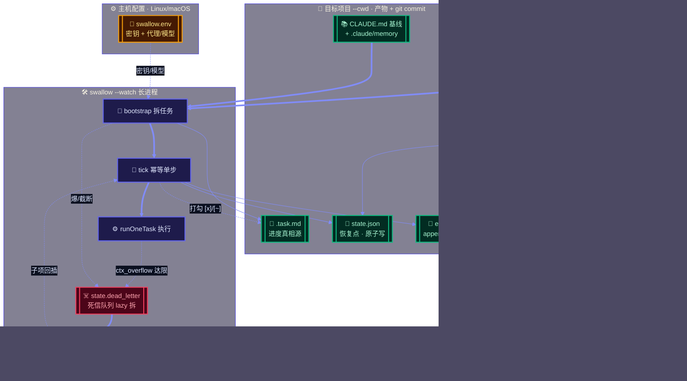

# swallow · 24 小时无人值守开发 orchestrator

> 给一个开发目标，它自己拆任务、自己执行、崩了自己恢复。

基于 [`@anthropic-ai/claude-agent-sdk`](https://github.com/anthropic-ai/claude-agent-sdk) 的 `query()` 驱动 Claude 自主完成一整个开发目标。Apache-2.0。

[](../LICENSE)
[](https://deepwiki.com/free-wyq/swallow)

> 📐 本文档是[产品落地页](https://free-wyq.github.io/swallow/)的 Markdown 镜像——GitHub 内可直接渲染阅读，落地页是渲染版。技术细节指向 [README](../README.md) 与 [install.md](../install.md)。

---

## 痛点：AI 编程的会话级天花板

交互式 AI 编程助手（如 Claude Code）以会话为核心，在长周期、无人值守场景下有四项结构性限制——人一离开，任务就停。

| 问题 | 描述 |
|---|---|
| **上下文溢出** | 上下文撑爆，任务中断，半截进度卡住 |
| **假完成** | 模型说"做完了"但零代码变更，无人复核就溜过去 |
| **进程级失效** | 网络/系统让进程退出，几小时进度随之丢失 |
| **无人值守中断** | 缺少自动恢复，任务等人介入才能继续 |

swallow 的目标：**给一个目标，系统自己拆任务、自己执行、崩了自己恢复。**

---

## 怎么解：重但稳 + 使用简单

核心理念：长跑拆成幂等单步 `tick`，状态双层落盘，进程崩溃天然可恢复。orchestrator 只管推进 + 结果结构化落盘，战报由外部 agent 读结果自行发送。

**三项原则：**

1. **任务分解** —— 长目标拆成幂等单步 `tick`，每步可独立恢复。bootstrap 像项目经理一样做结构判断，吃 CLAUDE.md 基线、不主动探索代码（防拆任务爆上下文）。
2. **可靠持久化** —— 状态/事件结构化落盘：`state.json` 原子写当恢复点，`events.jsonl` append-only 当审计流。`kill -9` 后从断点续跑，不丢进度、不重复打勾。
3. **职责解耦** —— orchestrator 只管推进与落盘，不发战报。外部 agent 定时读已落盘结果，自行组织文案发企微/钉钉/邮件。任一方挂了都不影响另一方。

---

## 特性：踩坑换来的防线，成熟库兜底

每一层防一种失效，核心机制用千万级周下载的成熟库实现，不手写。

| 机制 | 实现 | 防什么 |
|---|---|---|
| 原子写 | `write-file-atomic`（先写临时文件再 rename） | state.json/.task.md 写一半被 kill 截断 |
| 进程级锁 | `proper-lockfile`（stale 60s 自动 takeover） | 多 watch / 手动与 watch 并发冲突；kill -9 残留锁 |
| 假完成守卫 | PostToolUse 钩子看真实文件写入，零改动不打勾；连续 3 轮空转标阻塞 | agent 空退/假完成 |
| ctx 健康度探针 | 每轮测窗口占用，超 70% 先发 `/compact deep`，压不下再弃会话重开 | 跨 tick 累积撞墙 |
| 崩溃检测 | tick_started 与 tick_completed 配对 | 发现未完成的崩溃 tick |
| 日志轮转 + 心跳 | events 超 5000 行归档（丢明细不丢计数）；30s 心跳落盘 | append-only 涨到几百 MB；watch 卡死无人告警 |

### 死信队列 + lazy 拆：爆了才拆

拆到多细才不爆，只有跑到那里才知道。任务真撑爆上下文 → 入死信队列 → `splitTask` 拆成可单独完成的子项回插继续推进。**不预先递归猜深度**，用实际执行反馈代替预先猜测。

两道计数兜底防死循环：`failed_tasks≥5`（横向，不同 task 各自拆不出累计）/ `dlq_split_count≥30`（纵向，同几个 task 无限拆），达任一即 watch 停。详见 [dead-letter-design.md](dead-letter-design.md)。

---

## 架构：推进 + 结构化落盘 + 外部发战报

四个边界一图看清：主机配置（密钥）/ 目标项目（产物 + git）/ 脚本（orchestrator）/ 外部 agent（拉起 + 发战报）。



🎬 想看可交互的动态版？打开 **[动态架构演练页](https://free-wyq.github.io/swallow/architecture-demo.html)**（GitHub Pages 渲染，可触发各种场景看链路）。

---

## 快速开始

swallow 是纯 agent 化的——git clone + 注册 skill 即用。**唯一前提 Node 18+**，claude 引擎随 SDK 打包，无需另装 Claude Code。完整步骤（给 AI 助手读）见 [install.md](../install.md)。

```bash
# 1. 克隆代码（agent 无关，装到 ~/.local/share/swallow）
git clone --depth 1 https://github.com/free-wyq/swallow.git ~/.local/share/swallow

# 2. 注册 skill + 配密钥
mkdir -p ~/.config/swallow
cp ~/.local/share/swallow/swallow.env.example ~/.config/swallow/swallow.env
chmod 600 ~/.config/swallow/swallow.env   # 编辑填 ANTHROPIC_API_KEY=sk-...

# 3. 跑——直接调 skill 里的 run.sh（注册即用）
bash ~/.local/share/swallow/skill/run.sh --cwd /path/to/project "构建一个 Go REST API"
```

常用命令：

| 命令 | 作用 |
|---|---|
| `run.sh --cwd <proj> "目标"` | 裸跑 = `--watch`，自驱跑到完成 |
| `run.sh --cwd <proj> --status --json` | 结构化状态（给程序读，跨平台零依赖） |
| `run.sh --cwd <proj> --stop` | 停（写 `.stop` 哨兵 + 杀 `--watch`） |
| `run.sh --cwd <proj> --resume` | 恢复运行（删哨兵，watch 没在跑则从 state.json 拉起） |

> ⚠️ **别在 swallow 仓库根目录裸跑**——会把产物写进 swallow 仓库并 commit 它。用 `--cwd` 指向你的目标项目。

---

## 适用场景

| 场景 | 适用性 |
|---|---|
| 技术债批量修复（lint / 类型 / 重构） | ✅ **推荐**：批处理模式，无需逐行介入 |
| 方案已知的功能开发 | ✅ **推荐**：开发者定方案，AI 执行编码 |
| 24 小时无人值守构建 | ✅ **推荐**：睡前启动，醒来验证 |
| 高风险重构 | ⚠️ **谨慎**：建议先在非关键分支验证 |
| 探索性设计 | ❌ **不推荐**：需要开发者持续决策与反馈 |

> 💡 使用前确保项目里有 `CLAUDE.md`（swallow 代码直接读它当 bootstrap 基线）和 `.claude/memory/`（引擎自动注入跨会话记忆）知识沉淀——这两者直接影响任务拆解的准确性和效率。

---

## FAQ

**swallow 和 Claude Code 什么关系？**
Claude Code 是交互式助手，你在旁边盯着、随时反馈。swallow 是批处理引擎，给个目标就不管了，自己拆任务、自己执行、崩了自己恢复。两者互补——前者适合探索，后者适合无人值守。事实上 swallow 就是用 Claude Agent SDK（Claude Code 的底层引擎）驱动的。

**怎么控制成本？**
时间比 token 贵。swallow 默认不限 token / 不限轮数（token 不限量场景下轮数护栏纯属挡路），真正要避免的是在拆不掉的任务上持续浪费——死信队列的计数兜底比 token 硬限制更有效。行为护栏仍留正数防死循环。

**怎么拿运行报告？它发消息吗？**
orchestrator **不发消息**。每轮把进度/状态结构化写进 state.json + events.jsonl + .task.md，外部程序通过 `--status --json` 读结果，想发企微/钉钉/邮件都行。文案、频道、频率全由你定。接入实战见 [hermes-guide](hermes-guide.md) / [claude-code-guide](claude-code-guide.md)。

**支持其他模型吗？**
API 层能换——走代理/中转填 `ANTHROPIC_BASE_URL` 和 `ANTHROPIC_MODEL` 即可（e2e 就是用 GLM 代理真跑的）。但 `/compact` 等上下文管理机制需要目标模型支持，代理模型上下文有限时靠 ctx 健康度探针运行时实测兜底。

**生产能用吗？**
Apache-2.0 协议，e2e 全绿（happy path / 崩溃恢复 / 并发锁 / 停止哨兵 / 假完成守卫 / 死信队列）。核心依赖是千万级周下载的成熟库。建议先在非关键分支跑几轮验证再放到主力流程。

---

*版本：2026-08-01 · 仓库 [github.com/free-wyq/swallow](https://github.com/free-wyq/swallow)*
