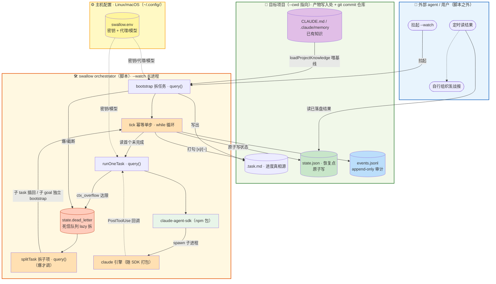
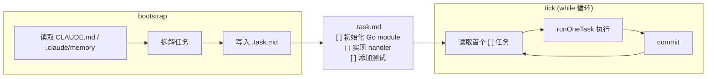
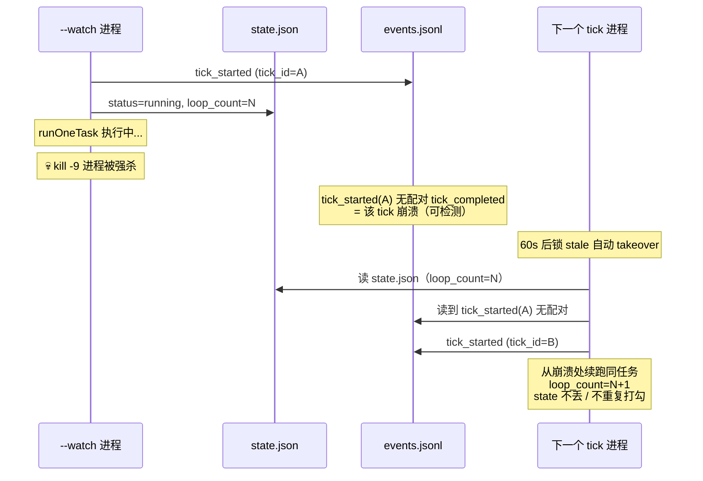
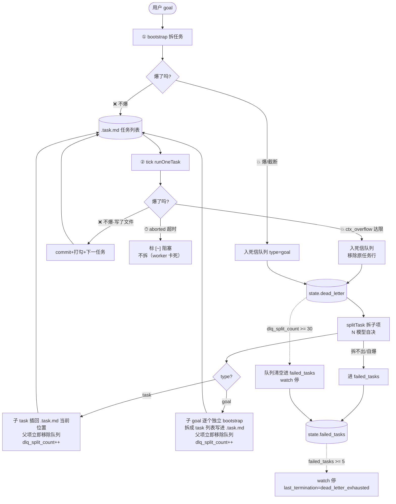
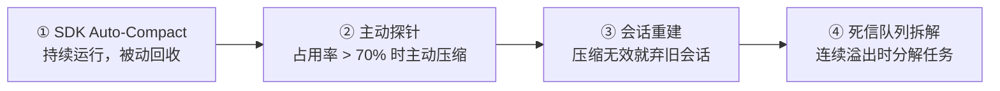

# Swallow：基于 Claude Agent SDK 的 24 小时无人值守开发 Orchestrator

> 分享时长 60 分钟（总分总结构），弹性预留 8 分钟。实践演示置于中篇与下篇之间。

---

## 一、开场（10 分钟）

### 1.1 标题页

**Swallow：基于 Claude Agent SDK 的 24 小时无人值守开发 Orchestrator**

- 运行时：`@anthropic-ai/claude-agent-sdk`
- 协议：Apache-2.0
- 仓库：[github.com/free-wyq/swallow](https://github.com/free-wyq/swallow)

### 1.2 问题域：AI 辅助开发的会话级天花板

当前 AI 编程助手（如 Claude Code）以交互式会话为核心工作模式，在长周期、无人值守场景下面临四项结构性限制：

| 问题 | 描述 |
|---|---|
| **上下文窗口溢出** | 上下文撑爆，任务中断 |
| **假完成** | 模型说"做完了"但零代码变更 |
| **进程级失效** | 网络/系统原因进程退出，几小时进度丢失 |
| **无人值守中断** | 缺少自动恢复，任务等人介入停滞 |

Swallow 的目标：给一个目标，系统自己拆任务、自己执行、崩了自己恢复。

### 1.3 架构总览



### 1.4 核心设计理念

Swallow 架构围绕三项原则展开：

1. **任务分解**：长目标拆成幂等单步（tick），每步可独立恢复
2. **可靠持久化**：状态/事件结构化落地，崩溃后精确恢复
3. **职责解耦**：Orchestrator 只管推进与落盘；战报由外部程序读结果自行发送

---

## 二、主体（40 分钟）

### 2.1 幂等 Tick 与崩溃恢复机制（13 分钟）

#### 2.1.1 BootStrap → Tick 生命周期



关键设计决策：
- `.task.md` 为**进度真相源**，`state.json` 仅为**快速恢复点**
- 完成判定依赖 `PostToolUse` 钩子捕获引擎实际文件写入事件，非事后 `git diff` 推断
- `disallowedTools` 排除 `EnterPlanMode` / `AskUserQuestion`，防止进程因等待用户输入而阻塞


#### 2.1.2 崩溃恢复时序



三个关键点：

- **原子写**（`write-file-atomic`）：写 state.json 时先写临时文件、再 rename 覆盖原文件，写到一半被杀死不会截断
- **进程锁**（`proper-lockfile`）：同时只能跑一个 watch，另一个检测到锁就退出。进程被杀死后锁 60 秒自动过期
- **崩溃检测**：events.jsonl 里每个 tick 记录开始事件，如果只有开始没有结束，下个进程就知道上一轮崩了

#### 2.1.3 会话策略与 Query 调用点

| 调用点 | 会话策略 | 触发条件 |
|---|---|---|
| bootstrap | 新会话 | 首次拆任务 |
| runOneTask | resume（续跑） | 常规执行 |
| probeCompactDeep | 探针会话 | 上下文占比 > 70% |
| splitTask | 新会话 | 死信出队拆解 |

用 `resume` 而不是 `continue`：continue 会累积上下文越跑越慢，resume 保持同一会话但靠 compact 回收。

**PostToolUse 钩子：** 引擎每写一个文件都通过 SDK 回调通知脚本。脚本根据文件变更数判定这轮有没有干活——有变更才 commit。

---

### 2.2 稳定性体系（12 分钟）

#### 2.2.1 七层防线


**Layer 1 - 原子写：** `write-file-atomic`，先写临时文件再 rename 覆盖，写到一半被杀原文件不损坏。

**Layer 2 - 进程锁：** `proper-lockfile`，每次只允许一个 watch 运行。进程被杀死后锁 60 秒自动过期。

**Layer 3 - 假完成守卫：** 模型说"做完了"但 PostToolUse 钩子没捕获到文件写入 → 不打勾（不依赖 git）。连续 3 轮零产出标阻塞，跳下一任务。另有一个 git 依赖的兜底：全部任务跑完后如果全程零 commit，标记疑假完成等人来看——但如果项目没有 git，这个兜底会误报。

**Layer 4 - 上下文探针：** 每轮测窗口使用率，超过 70% 主动发 `/compact deep` 压缩。压缩无效再弃会话重建。

#### 2.2.2 可观测性

| 文件 | 用途 |
|---|---|
| state.json | 恢复点（原子写） |
| events.jsonl | 审计日志（超 5000 行自动轮转归档，丢明细不丢计数） |
| night_run.log | 人类可读日志 |
| --status --json | 外部程序读状态 |

每 30 秒心跳写入 state.json，外部进程据此判断 watch 是否卡死。

---

### 2.3 演示（10 分钟）

```bash
# 1. 启动
swallow --cwd /tmp/demo "初始化一个 Node.js CLI 工具"

# 2. 看状态
swallow --cwd /tmp/demo --status

# 3. 看审计日志
tail -3 /tmp/demo/events.jsonl

# 4. (可选) 崩溃恢复: kill -9 <pid> → 再跑 --status 看自动续跑
```

---

### 2.4 反馈驱动拆解：死信队列机制（15 分钟）

#### 2.4.1 问题边界

bootstrap 拆出来的任务可能仍然太大。三种常规做法都有问题：

| 策略 | 问题 |
|---|---|
| 预先递归拆到底 | 深度靠猜，过深浪费、过浅还得拆 |
| 一次全拆完 | bootstrap 自己就爆了 |
| 固定粒度 | 任务复杂度不均，固定粒度不适用 |

#### 2.4.2 死信队列链路

完整架构已在 1.3 展示，下面对焦死信队列分支：



图已包含完整链路：入队条件、出队拆解按 type 分流、两兜底（`failed_tasks>=5` 横向 / `dlq_split_count>=30` 纵向）。

#### 2.4.3 设计对比

| 维度 | 预先递归拆解 | 反馈驱动拆解 |
|---|---|---|
| 触发时机 | 执行前一次完成 | 运行时按需触发 |
| 拆解深度 | 固定预设值 | 实测边界 |
| Token 成本 | 可能拆出用不到的细项 | 只拆这次溢出的 |
| 工程复杂度 | 递归 + 深度判定 | 单层拆解 + 计数兜底 |
| 终止保证 | 无确定性终止条件 | 双向计数兜底 |

**核心结论：** 拆到多细才不爆上下文，只有跑到那里才知道。所以拆解应该在运行时、由溢出事件驱动。

#### 2.4.4 上下文管理递进策略



---

## 三、总结（8 分钟）

### 3.1 核心要点

- **长任务拆成短步**：幂等 tick + 崩溃恢复，崩了续跑不丢进度
- **七层防线**：每层防一种失效，踩坑换来的
- **爆了再拆**：拆解粒度是运行时的信息，不是设计阶段能预知的

### 3.2 适用场景与限制

| 场景 | 适用性评估 |
|---|---|
| 技术债批量修复（lint / 类型 / 重构） | **推荐**：批处理模式，无需逐行介入 |
| 方案已知的功能开发 | **推荐**：开发者确定方案，AI 执行编码 |
| 24 小时无人值守构建 | **推荐**：睡前启动，醒来验证 |
| 探索性设计 | **不推荐**：需要开发者持续决策与反馈 |
| 高风险重构 | **谨慎使用**：建议先在非关键分支验证 |

建议：使用前确保项目中存在 `CLAUDE.md` 和 `.claude/memory/` 知识沉淀，这两者直接影响任务拆解的准确性和效率。

### 3.3 预设问答

#### Q1: Swallow 和 Claude Code 什么关系？

Claude Code 是交互式助手，你在旁边盯着。Swallow 是批处理引擎，给个目标就不管了。两者互补。

#### Q2: 怎么控制成本？

时间比 token 贵。真正要避免的是在拆不掉的任务上持续浪费——死信队列的计数兜底比 token 硬限制更有效。

#### Q3: 怎么拿运行报告？

Swallow 不发消息。外部程序通过 `--status --json` 读结果，想发企微/钉钉/邮件都行。

#### Q4: 支持其他模型吗？

API 层能换（改环境变量），但 `/compact` 等上下文管理机制需要目标模型支持。

#### Q5: 生产能用吗？

Apache-2.0 协议，e2e 全绿。核心依赖是千万级周下载的成熟库。建议先在非关键分支跑几轮验证。

---

## 附录：时间线总表

| 段落 | 内容 | 时间 |
|---|---|---|
| 开场 | 痛点 / 架构 / 三项原则 | 10min |
| 上篇 | 生命周期 / 崩溃恢复 / 会话策略 | 13min |
| 中篇 | 七层防线 / 可观测性 | 12min |
| | 演示 | 10min |
| 下篇 | 死信队列 / 反馈驱动拆解 | 15min |
| 总结 | 回顾 / 场景 / Q&A | 8min |

**超时备选：** 防线各层一句话带过（省 2min）、探针细节跳过（省 1min）、崩溃演示改放视频（省 2min）
---

*版本：2026-07-25*
*项目：[github.com/free-wyq/swallow](https://github.com/free-wyq/swallow)*
