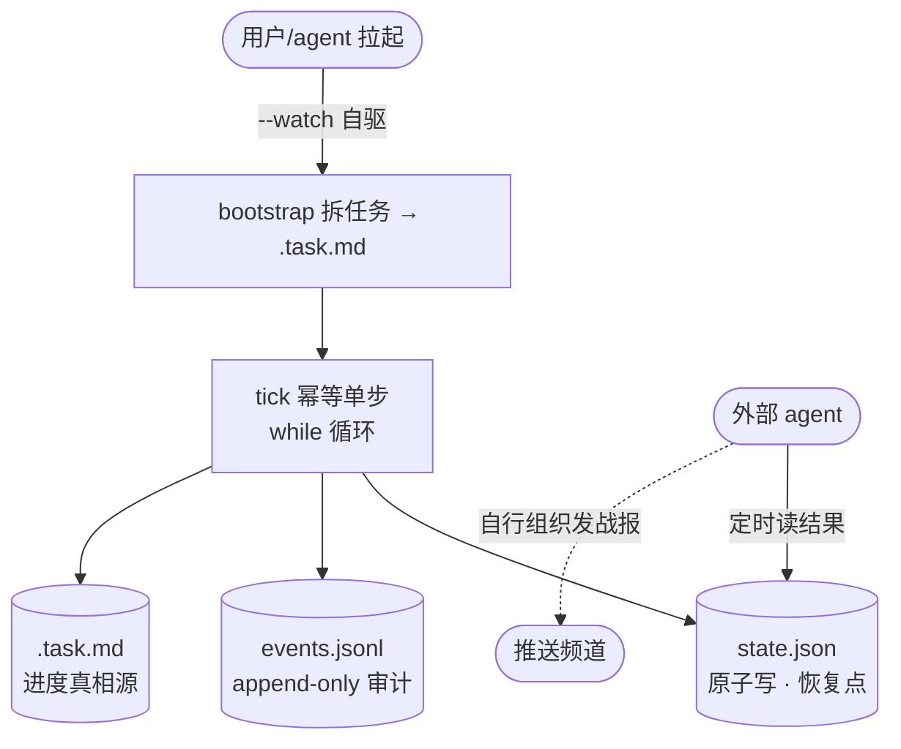

# Loop Scheduler

loop-orchestrator（`orchestrator.ts`，用 `@anthropic-ai/claude-agent-sdk` 的 `query()` 写的 24h 无人值守开发 orchestrator）的接入说明。

## 职责边界

- **orchestrator**：只管推进 + 把结果结构化落盘（`state.json` 恢复点 + `events.jsonl` 审计流）。不发战报、不推送。
- **外部 agent**：定时读 state/events 这些结构化结果，自行组织发送战报。战报文案、推送频道、频率全由 agent 决定，orchestrator 不掺和。

推进靠 `--watch` 长进程（一次拉起自驱跑到完成），崩了重启续跑，不依赖外部触发。

## 架构



三者解耦：推进（watch 自管，崩了重启续跑）/ 结果（可靠落盘）/ 战报（外部 agent 读结果自组织）。watch 挂了不影响外部 agent 读已落盘结果发战报；外部 agent 挂了不影响 watch 推进。

## 结构化结果（agent 发战报的数据源）

### state.json（恢复点快照，原子写）

```jsonc
{
  "version": 1,
  "goal": "构建一个 Go REST API",
  "loop_count": 15,
  "stall_task": null,            // 当前空转任务，null=无
  "stall_count": 0,              // 连续空转次数，满 STALL_LIMIT(3) 标阻塞
  "had_any_commit": true,        // 防假完成守卫
  "session_retries": 0,          // 当前任务连续 ctx 撑爆次数，满3标阻塞
  "status": "idle",              // idle/running/blocked_suspect/completed/ctx_overflow_retry
  "last_tick_at": "2026-07-24 14:00:00",
  "last_tick_id": "20260724-140000-a1b2",
  "last_termination": null       // {reason:"done", ts} | null
}
```

`status` 关键值（agent 判断要不要告警/推送）：
- `running` — 推进中
- `idle` — 空闲（tick 之间）
- `completed` — 全部完成
- `blocked_suspect` — 疑假完成，需人工介入
- `ctx_overflow_retry` — 撞上下文重试中（未达上限）

### events.jsonl（append-only 审计流，每行一个事件）

```jsonc
{"ts":"...","type":"task_completed","tick_id":"...","loop_count":15,"data":{"task":"...","committed":true}}
```

事件类型：`tick_started` / `tick_completed` / `task_completed` / `task_stall` / `task_blocked` / `session_dropped` / `aborted` / `done` / `suspected_false_completion` / `bootstrap_completed` / `session_created` / `session_resumed` / `tick_skipped` / `tick_locked`。

**崩溃检测**：`tick_started` 无同 `tick_id` 的 `tick_completed` = 该 tick 崩溃。

### .task.md（进度真相源）

任务列表 + 勾选状态：`[ ]` 未完成 / `[x]` 已完成 / `[~]` 阻塞。agent 发战报的进度数从这读。

## 安装

```bash
curl -fsSL https://raw.githubusercontent.com/free-wyq/loop/main/install.sh | bash
```

装到中立路径：代码 `~/.local/share/loop`、命令 `~/.local/bin/loop`、配置 `~/.config/loop.env`（密钥/代理/模型）。不碰 shell rc、不替用户装 Node、不静默覆盖（已有备份 `.bak`）。

## 用法

### 1. 拉起推进（一次）

```bash
loop --cwd /path/to/project "构建一个 Go REST API"
```

`--watch` 自驱：bootstrap 拆任务 → `while(tick())` 推进 → 每轮 commit。崩了重启 `loop --cwd <proj>` 续跑（state.json 接着上次的 loop_count）。

⚠️ 目标项目绝不能是 loop 仓库自身——会污染 git 历史。

### 2. 外部 agent 定时读结果发战报

起一个定时任务，读 state.json/events.jsonl/.task.md，按自己的判断组织战报文案、推送到自己的频道：

```bash
# 定时（示例，具体由该 agent 的定时机制实现）
# 读最新状态：
cat /path/to/project/state.json
tail -8 /path/to/project/events.jsonl
```

orchestrator 不参与战报生成——它只保证结果结构化、可靠落盘，外部 agent 爱怎么读、怎么推都行。推进与观察彻底解耦：watch 挂了不影响外部 agent 读结果发战报，外部 agent 挂了不影响 watch 推进。

### 3. 操控命令

| 操作 | 命令 |
|---|---|
| 实时状态 | `loop --cwd <proj> --status` |
| 运行报告 | `loop --cwd <proj> --report` |
| 临时停 | `loop --cwd <proj> --stop`（写 .stop 哨兵，watch 下次 tick 检测到则退出） |
| 恢复 | `loop --cwd <proj> --resume`（删 .stop） |

## 注册成当前 agent 的 skill（可选）

多数 agent 的 skill 扫描器用 find/glob 遍历 skills 目录、**默认不跟 symlink 进子目录**——symlink 进去扫描器看不见。所以拷成真目录：

```bash
# 推理你 agent 的 skills 目录（常见：~/.claude/skills · ~/.codex/skills · ~/.gemini/skills · ~/.cursor/skills · ~/.hermes/skills）
SKILLS_DIR=~/.claude/skills
mkdir -p "$SKILLS_DIR"; rm -rf "$SKILLS_DIR/loop-scheduler"
cp -r ~/.local/share/loop/skill "$SKILLS_DIR/loop-scheduler"
# 验证：find "$SKILLS_DIR/loop-scheduler" -name SKILL.md   # 应返回一行
```

loop 升级后重跑上述命令刷新。

## 密钥 / 代理配置

非交互进程跑干净 env 不 source `~/.bashrc`，密钥写进 `~/.config/loop.env`（orchestrator 启动自动读，已 export 的不覆盖）：

```bash
cp ~/.local/share/loop/loop.env.example ~/.config/loop.env && chmod 600 ~/.config/loop.env
# 填 ANTHROPIC_API_KEY=sk-...；走代理加 ANTHROPIC_BASE_URL=http://...:3000、ANTHROPIC_MODEL=glm-5.1
```

限额不在这——写死在 `orchestrator.ts` 顶部常量（token 不限量场景下预算/轮数护栏纯属挡路，一律 `0=不限`；行为护栏 `STALL_LIMIT`/`ABORT_TIMEOUT_MIN`/`SESSION_RETRY_LIMIT` 留正数防死循环）。要改改代码，不读 loop.env。详见 [install.md](../install.md)。

## 崩溃恢复（自动，无需人工）

`--watch` 内部是幂等 `tick()`。某轮被杀（重启 / kill -9）：
- `state.json` 原子写未截断（恢复点不丢）
- `events.jsonl` 里该 `tick_started` 无配对 `tick_completed` = 崩溃可检测
- 进程级锁 `.tick.lock` 60s 后 stale 自动 takeover
- 重启 `loop --cwd <proj>` 从崩溃处续跑，`loop_count` 不丢、不重复打勾

**watch 临时挂了重启即可**，自动接着跑，不用重新 bootstrap。

## 已知坑

1. **`orchestrator.ts` 不能搬走**——依赖 loop 仓库的 `node_modules`，本体留仓库跟版本走。
2. **目标项目绝不能是 loop 仓库自身**——会污染 git 历史。
3. **推进靠 watch 长进程**——它崩了需重启才继续。要无人值守自动拉起，靠 systemd `Restart=always` / supervisor / 外部 agent 守护。
4. **orchestrator 不发战报**——只把结果结构化到 state/events，战报由外部 agent 读结果自行发。
5. **改目标项目换 `--cwd`**，别改 orchestrator。
